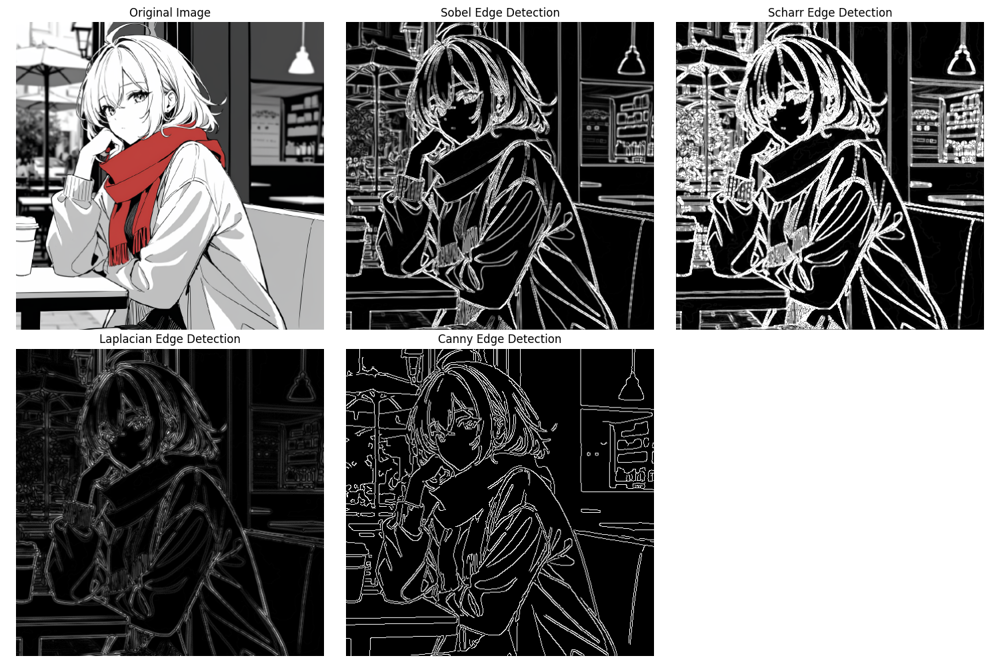
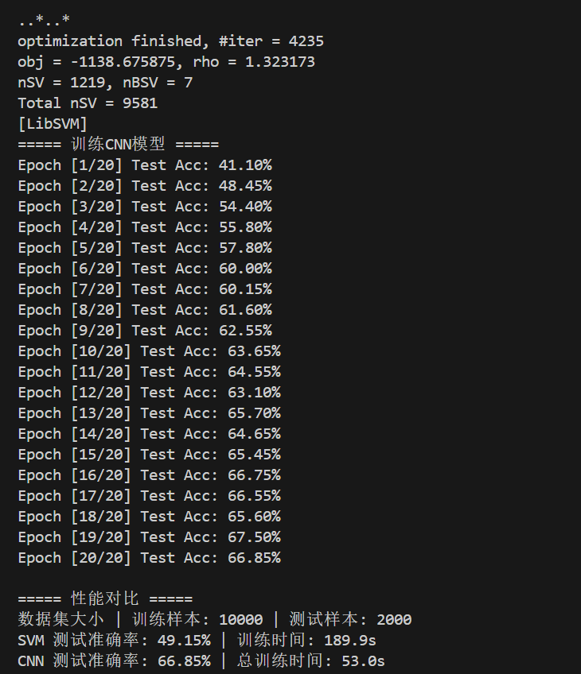
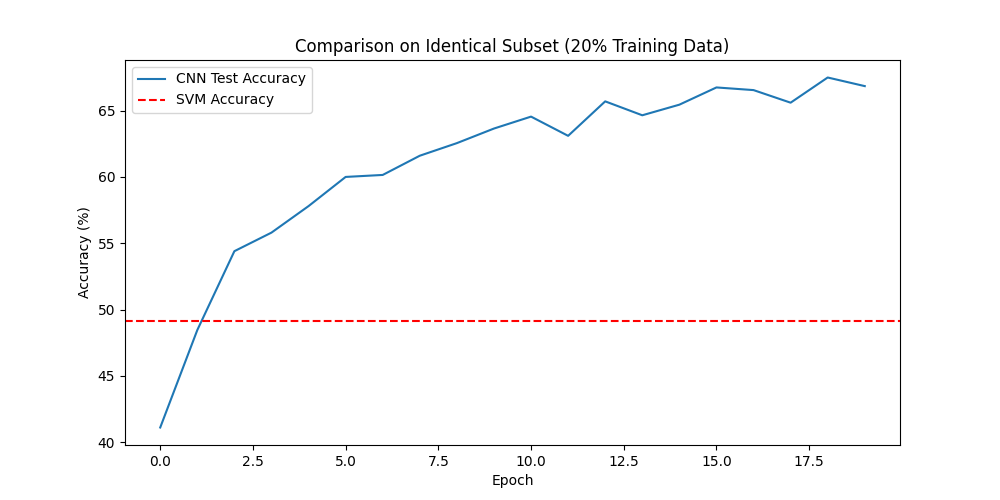

# 作业-1:图像边缘检测与分类

22331095 王志杰

使用Python+0penCV实现以下功能:
任选一张图像，使用边缘检测算法Sobel检测图像边缘。展示原图像和分割后的图像。
选择一种机器学习方法(支持向量机(SVM)、决策树等)和一种深度学习方法(MLP、CNN等)，实现图像分类，数据集任选(如MNIST、CIFAR-10)，对比两种方法的准确率和计算效率。

## 1. 边缘检测

在这里实现了多种边缘检测算法并简单介绍原理

### **1. Sobel算子**

#### 原理

- **方向梯度检测**：通过计算图像在**水平（x）**和**垂直（y）**方向的一阶导数，捕捉边缘的梯度变化。
- **特点**：
  计算速度快，边缘较粗，对噪声敏感。

#### 代码实现

```python
sobel_x = cv2.Sobel(gray, cv2.CV_64F, 1, 0, ksize=3)  # x方向梯度
sobel_y = cv2.Sobel(gray, cv2.CV_64F, 0, 1, ksize=3)  # y方向梯度
sobel_combined = cv2.addWeighted(...)  # 合并双向梯度
```

------

### **2. Scharr算子**

#### 原理

- **改进版Sobel**：使用更大的核增强梯度计算的精度，尤其对**斜向边缘**更敏感。
- **特点**：
  边缘定位更精确，但计算量略大于Sobel。

#### 代码实现

```python
scharr_x = cv2.Scharr(gray, cv2.CV_64F, 1, 0)  # x方向梯度
scharr_y = cv2.Scharr(gray, cv2.CV_64F, 0, 1)  # y方向梯度
scharr_combined = cv2.addWeighted(...)          # 合并结果
```

------

### **3. Laplacian算子**

#### 原理

- **二阶导数检测**：通过计算图像的二阶导数（梯度变化率），直接定位边缘的零交叉点（Zero Crossing）。
- **特点**：
  对噪声敏感（需先高斯模糊），边缘细且可能断裂，适合检测孤立点或线。

#### 代码实现

python

```python
blur = cv2.GaussianBlur(gray, (5,5), 0)  # 先降噪
laplacian = cv2.Laplacian(blur, cv2.CV_64F)  # 二阶导数计算
laplacian_abs = cv2.convertScaleAbs(laplacian)  # 转换为8位图像
```

------

### **4. Canny算法**

#### 原理

- 多阶段检测
  1. **高斯模糊**：降噪。
  2. **梯度计算**（Sobel算子）：获取梯度幅值和方向。
  3. **非极大值抑制**：保留局部梯度最大的像素，细化边缘。
  4. **双阈值检测**
     - 高阈值以上：强边缘（保留）。
     - 低阈值以下：非边缘（丢弃）。
     - 中间值：弱边缘（仅当与强边缘连接时保留）。
- **特点**：
  边缘连续、抗噪声能力强，但计算复杂度较高。

#### 代码实现

```python
canny = cv2.Canny(blur, 100, 200)  # 双阈值：低=100，高=200
```

### 实现的结果



## 2. 图像分类

在这里比较了SVM和CNN的图像分类的性能，数据集选用了cifar10

### 1**. 算法简介**

#### **(1) 支持向量机（SVM）**

- **核心思想**：通过寻找最大化类别间隔的超平面进行分类，适用于高维数据
- **特点**
  - 依赖核函数处理非线性可分数据（如本程序使用的RBF核）
  - 对数据缩放敏感（需标准化）
  - 训练复杂度高（约O(n²~n³)），不适合超大数据集
- **图像分类局限性**：
  需手动展平为向量（丢失空间信息），难以自动提取局部特征

#### **(2) 卷积神经网络（CNN）**

- **核心思想**：通过卷积层自动学习图像的局部空间特征，配合池化层降维
- **特点**
  - 保留图像的空间结构信息
  - 参数共享减少计算量
  - 适合处理平移、缩放、旋转等变换的鲁棒性需求
- **优势**：
  在图像分类任务中通常优于传统方法（如SVM）

------

### **2. 程序改进措施**

#### **(1) 统一预处理**

CNN和SVM使用相同的归一化参数（`Normalize((0.5, 0.5, 0.5), (0.5, 0.5, 0.5))`），消除预处理差异；使用`Subset`随机采样20%的训练和测试数据（原CIFAR-10训练集5万→1万，测试集1万→2千），确保对比公平性

#### **(2) SVM优化调整**

- **移除降维**：
  直接使用展平后的原始像素（32x32x3=3072维），不做降维，避免PCA导致的信息损失
- **核函数选择**：
  使用RBF核（`kernel='rbf'`）处理非线性分类问题

#### **(3) CNN结构优化**

- **加入BatchNorm**：
  加速收敛并提升泛化能力
- **Dropout正则化**：
  防止过拟合（全连接层设`Dropout(0.5)`）
- **动态学习率调整**：
  使用`ReduceLROnPlateau`根据验证准确率调整学习率

------

### **3. 性能对比结果**

可以看到CNN的性能表现更好，主要是由于卷积层通过滑动窗口捕捉**空间局部性**，池化层实现**平移不变性**，算法更契合图像的二维结构特性

这里SVM的时间更长，这是因为cifar10数据集太大，有五万张，虽然已经选取了其中20%的子集但还是太大了，时间复杂度较高，而且参数量要比CNN多得多，还是更适合小数据集的任务





------

### **4. 应用场景建议**

- SVM
  - 小规模数据集（样本量<1万）
  - 低维特征或需可解释性的任务
  - 硬件资源有限时快速验证
- CNN
  - 大规模图像数据
  - 高精度要求的复杂分类任务
  - 需自动特征提取的端到端学习

### 5. 一些改进的想法

比如可以改进CNN结构，加深网络或者加入一些resnet这样的成熟改进架构，但是局限于算力就没有进行实验

另外还可以提前进行数据增强，这样丰富了数据集也能提高模型性能，不过考虑到这里只是对SVM和CNN进行评估，预处理还是保持统一为好
