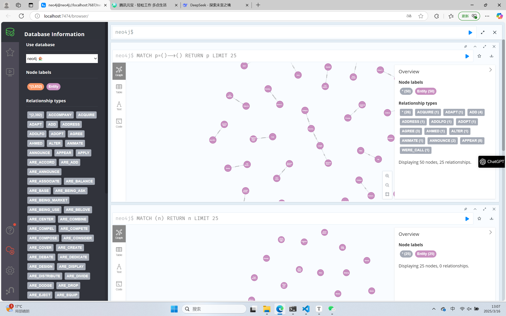
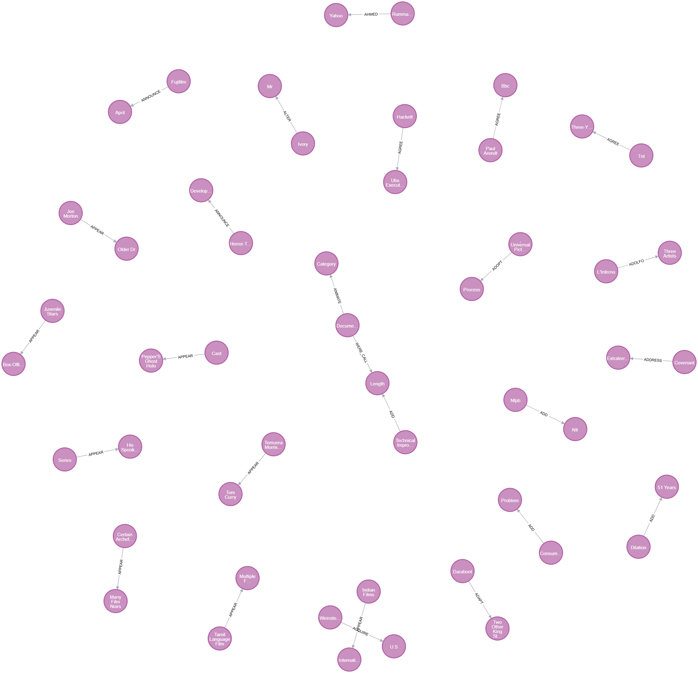

# 作业-2:构建小型领域知识图谱

22331095 王志杰

自己选择数据集，说明数据来源。
使用NLP工具(如spaCy)提取实体和关系
用Neo4j构建图谱并可视化关键节点

## 1. 数据集

在这个作业中，我参考了这篇博客的内容[机器学习中的知识图谱 - Analytics Vidhya](https://www.analyticsvidhya.com/blog/2019/10/how-to-build-knowledge-graph-text-using-spacy/)，使用了和他相同的数据集[wiki_sentences_v2.csv - Google 云端硬盘](https://drive.google.com/file/d/1yuEUhkVFIYfMVfpA_crFGfSeJLgbPUxu/view)，这是一组与 Wikipedia 文章相关的电影和电影中的文本。作者从 500 多篇维基百科文章中提取了大约 4,300 个句子。这些句子中的每一个都包含两个实体 ： 一个主语和一个宾语。

## 2. 提取实体和关系

第一步是使用spacy提取实体和关系，为了neo4j构建知识图谱做准备

然而，虽然我参考了上文提到的博客的内容，我认为他的entity提取并不精确。经过我的试验，效果并不好，当然这也和数据集本身有关系，但是他的代码是存在问题的，比如，他不能处理被动语态，不能提取否定的动作，存在很多无效的代词，有很多不必要的循环

为此我做了很多改进，对于entity提取，我采用语法依赖分析 + 名词块修正的方式，去除了限定词，然后增加了对被动语态的识别

```
def get_entities(sent):
    doc = nlp(sent)
    subj_entities = []
    obj_entities = []

    for token in doc:
        # 处理主语
        if token.dep_ in ['nsubj', 'nsubjpass']:
            for chunk in doc.noun_chunks:
                if chunk.root.i == token.i:
                    # 去除限定词
                    if chunk[0].dep_ == 'det' and len(chunk) > 1:
                        clean_chunk = chunk[1:].text
                    else:
                        clean_chunk = chunk.text
                    subj_entities.append(clean_chunk)
                    break
        
        # 处理宾语
        elif token.dep_ in ['dobj', 'pobj', 'iobj']:
            for chunk in doc.noun_chunks:
                if chunk.root.i == token.i:
                    if chunk[0].dep_ == 'det' and len(chunk) > 1:
                        clean_chunk = chunk[1:].text
                    else:
                        clean_chunk = chunk.text
                    obj_entities.append(clean_chunk)
                    break

    ent1 = subj_entities[0] if subj_entities else ""
    ent2 = obj_entities[0] if obj_entities else ""

    return [ent1.strip(), ent2.strip()]

```

对于relation的提取，我使用词元保持时态一致性，同时支持使用复杂动词，比如否定

```
# 关系提取优化函数
def get_relation(sent):
    doc = nlp(sent)
    root_verbs = [token for token in doc if token.dep_ == 'ROOT']
    if not root_verbs:
        return ""
    
    # 提取动词短语
    verb = root_verbs[0]
    phrase = []
    for child in verb.children:
        if child.dep_ in ('aux', 'auxpass', 'neg'):
            phrase.append(child.text)
    phrase.append(verb.lemma_)
    return ' '.join(phrase)
```

然后我进行了数据清洗：主要四个步骤，去除空值，过滤代词，统一格式，去掉重复的relation

```
# 1. 去除空值
kg_df = kg_df[(kg_df['source'] != '') & 
             (kg_df['target'] != '') & 
             (kg_df['relation'] != '')]

# 2. 过滤代词
pronouns = {'i', 'you', 'he', 'she', 'it', 'we', 'they', 'me', 'him', 'her', 'us', 'them'}
kg_df = kg_df[~kg_df['source'].str.lower().isin(pronouns) &
             ~kg_df['target'].str.lower().isin(pronouns)]

# 3. 标准化格式
kg_df['source'] = kg_df['source'].str.title()
kg_df['target'] = kg_df['target'].str.title()

# 4. 去除重复项
kg_df = kg_df.drop_duplicates(subset=['source', 'target', 'relation'])
```

经过这样的处理，最终得到entities.csv和relations.csv，可以注意到relations经过处理只剩下两千四百个了，初始数据集有四千多个句子

## 3. 构建知识图谱

使用neo4j构建知识图谱，neo4j内置浏览器端可视化工具，支持实时渲染百万级节点关系图

neo4j的安装和配置过程不多赘述了，可以参考[Neo4j安装与配置以及JDK安装与配置教程（超详细）_neo4j 数据库javase1.8-CSDN博客](https://blog.csdn.net/2301_77554343/article/details/135692019)

csv构建知识图谱的过程中，我将relation命名格式规范为neo4j的标准，使用Subgraph批量创建node，对relation分组并分批提交，优化性能加速构建，使用`MERGE`而非`CREATE`避免重复关系

```
# 批量创建节点
nodes = [Node("Entity", name=row['entity']) for _, row in entities.iterrows()]
graph.create(Subgraph(nodes))
```

```
# 按关系类型分组处理
grouped = relations.groupby('relation')

for rel_type, group in grouped:
    # 分批提交（每组关系类型单独处理）
    batch_size = 1000
    for i in range(0, len(group), batch_size):
        batch_data = group[i:i+batch_size].to_dict('records')
        
        # 动态生成Cypher查询
        query = f"""
        UNWIND $data AS row
        MATCH (a:Entity {{name: row.source}}), (b:Entity {{name: row.target}})
        MERGE (a)-[:`{rel_type}`]->(b)
        """
        graph.run(query, data=batch_data)
```

最终构建出的知识图谱（取25个节点为示例）




