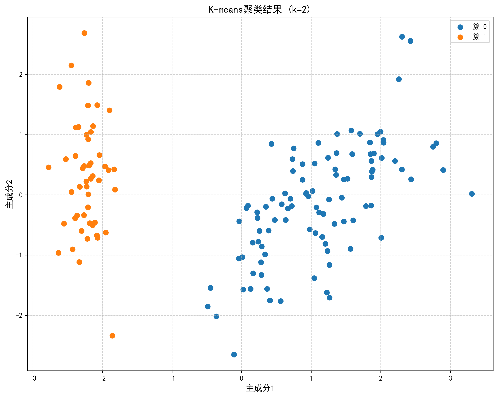
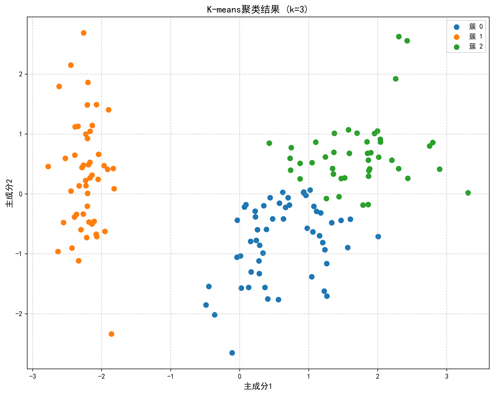
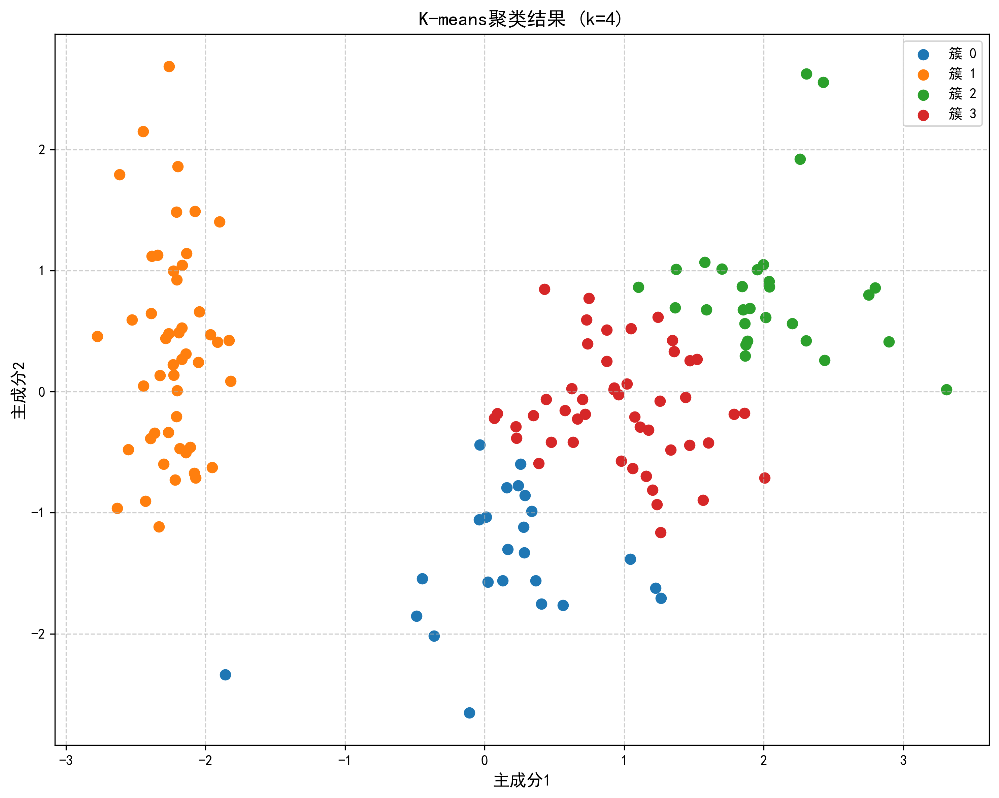
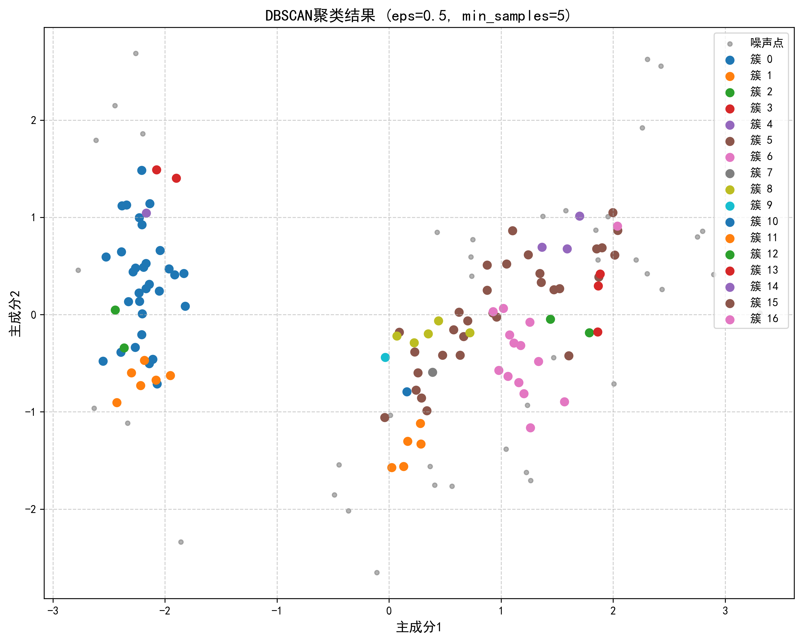
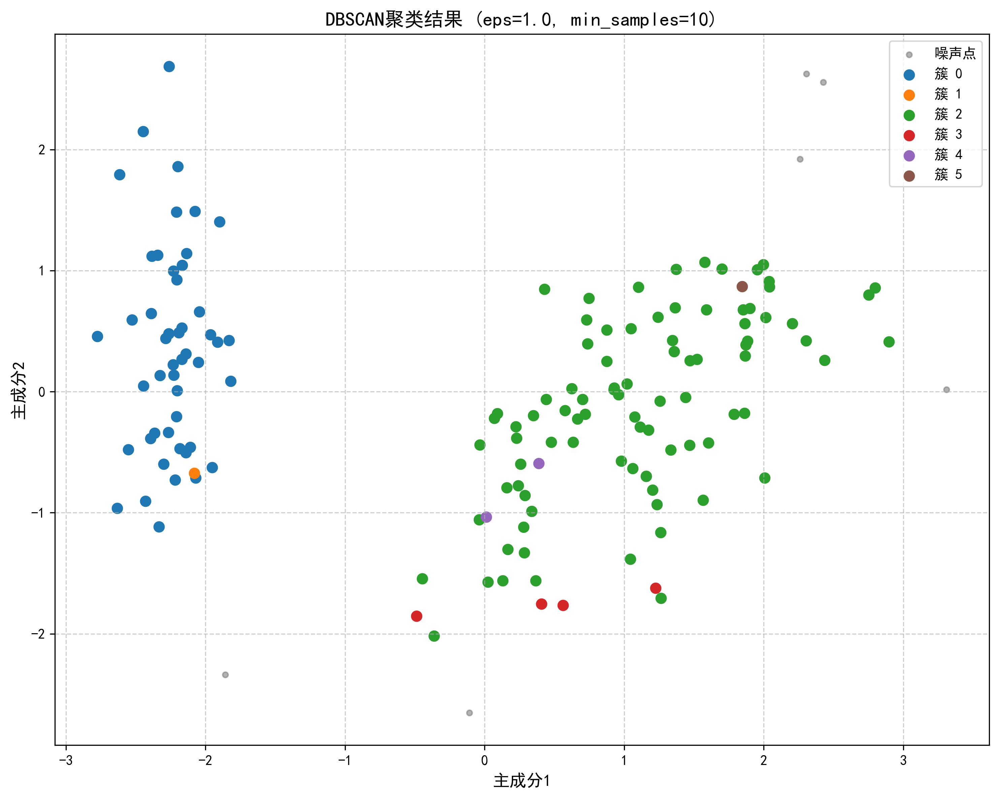
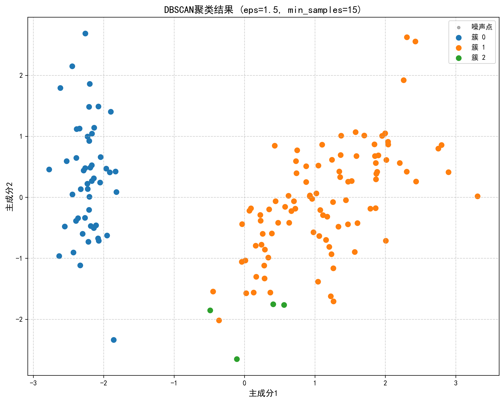

# 作业-3:聚类算法对比实验

22331095 王志杰

在鸢尾花数据集上实现K-means和DBSCAN算法
调整超参数(如簇数、邻域半径)观察聚类结果变化
用准确率、轮廓系数和Calinski-Harabasz指数评估性能
禁止直接调用完整工具包(如scikit-learn的完整聚类接口)，需实现核心逻辑

## 1. Kmeans

- 需要预先指定簇数量(k=2/3/4)
- 采用欧氏距离进行样本分配
- 通过随机选择初始质心（固定随机种子保证可重复性）
- 包含空簇处理机制：当出现空簇时随机选择新样本作为质心
- 迭代终止条件：质心移动距离小于容差(tol=1e-4)或达到最大迭代次数(100)

```
class KMeans:
    def __init__(self, n_clusters=3, max_iter=100, tol=1e-4):
        self.n_clusters = n_clusters
        self.max_iter = max_iter
        self.tol = tol
        self.centroids = None
        self.labels = None

    def fit(self, X):
        # 改进的质心初始化：使用更稳定的随机选择
        np.random.seed(42)
        self.centroids = X[np.random.choice(X.shape[0], self.n_clusters, replace=False)]
        
        for _ in range(self.max_iter):
            # 使用cdist加速距离计算
            distances = cdist(X, self.centroids, 'euclidean')
            self.labels = np.argmin(distances, axis=1)
            
            new_centroids = np.array([X[self.labels == i].mean(axis=0) 
                                      for i in range(self.n_clusters)])
            
            # 处理空簇问题
            empty_clusters = np.where(np.isnan(new_centroids).any(axis=1))
            for i in empty_clusters:
                new_centroids[i] = X[np.random.randint(0, X.shape[0])]
            
            if np.linalg.norm(new_centroids - self.centroids) < self.tol:
                break
            self.centroids = new_centroids
```

## 2. DBSCAN

- 基于密度聚类，不需要预先指定簇数量
- 参数包括邻域半径(eps)和最小样本数(min_samples)
- 能识别噪声点（标记为-2）
- 使用距离矩阵加速邻域查询
- 通过广度优先搜索扩展聚类簇
- 支持不同密度分布的聚类

```
class DBSCAN:
    def __init__(self, eps=0.5, min_samples=5):
        self.eps = eps
        self.min_samples = min_samples
        self.labels = None

    def fit(self, X):
        n = X.shape[0]
        self.labels = np.full(n, -1, dtype=int)
        cluster_id = 0
        dist_matrix = cdist(X, X, 'euclidean')
        
        for i in range(n):
            if self.labels[i] != -1:
                continue
                
            neighbors = np.where(dist_matrix[i] < self.eps)[0]
            if len(neighbors) < self.min_samples:
                self.labels[i] = -2  # 噪声点
            else:
                self._expand_cluster(i, neighbors, cluster_id, dist_matrix)
                cluster_id += 1

    def _expand_cluster(self, point, neighbors, cluster_id, dist_matrix):
        self.labels[point] = cluster_id
        i = 0
        while i < len(neighbors):
            neighbor = neighbors[i]
            if self.labels[neighbor] == -2:
                self.labels[neighbor] = cluster_id
            elif self.labels[neighbor] == -1:
                self.labels[neighbor] = cluster_id
                new_neighbors = np.where(dist_matrix[neighbor] < self.eps)[0]
                if len(new_neighbors) >= self.min_samples:
                    neighbors = np.unique(np.concatenate([neighbors, new_neighbors]))
            i += 1
```

## 3. 评估

评估部分我主要调用了现有的库，没有自己从零实现

1. 准确率计算：

   - 使用匈牙利算法对齐预测标签和真实标签

   - 仅在有标签数据上计算（过滤噪声点）

   - 通过confusion_matrix + linear_sum_assignment实现最优匹配

     ```
         def _align_clusters(y_true, y_pred):
             contingency = confusion_matrix(y_true, y_pred)
             row_ind, col_ind = linear_sum_assignment(-contingency)
             return col_ind[y_pred]
     ```

2. 轮廓系数：

   - 衡量簇内紧密度和簇间分离度
   - 值域[-1,1]，越大越好
   - 自动跳过单簇无效情况

3. Calinski-Harabasz指数：

   - 通过簇间离散度与簇内离散度的比值计算
   - 值越大表示聚类效果越好
   - 同样包含单簇保护机制

4. 可视化评估：

   - 使用PCA降维到2D空间展示
   - 区分显示噪声点（灰色）和聚类簇

## 4. 结果













| 算法及参数                       | 有效样本数 | 准确率 | 轮廓系数 | Calinski-Harabasz指数 |
| :------------------------------- | :--------- | :----- | :------- | :-------------------- |
| K-means (k=2)                    | 150        | 0.6667 | 0.5818   | 251.3493              |
| K-means (k=3)                    | 150        | 0.8133 | 0.4630   | 241.4263              |
| K-means (k=4)                    | 150        | 0.3200 | 0.4151   | 206.2286              |
| DBSCAN (eps=0.5, min_samples=5)  | 109        | 0.2844 | -0.1849  | 39.2340               |
| DBSCAN (eps=1.0, min_samples=10) | 144        | 0.6736 | -0.1374  | 65.9832               |
| DBSCAN (eps=1.5, min_samples=15) | 150        | 0.6933 | 0.3968   | 143.2443              |

- **K-means**在鸢尾花数据集上的表现对聚类数量k非常敏感。当k设置为3时，最接近数据的真实结构，表现最佳。k=2或k=4时，性能下降明显。（k=4下降是因为过度细分导致簇结构破坏）
- **DBSCAN**的表现对参数eps和min_samples非常敏感。参数设置不当可能导致大量样本被误判为噪声或聚类效果不佳。在eps=1.5和min_samples=15时，DBSCAN的表现相对较好。说明较大半径能捕捉更多有效样本，适当提高密度要求可改善聚类质量
- **对比**：K-means在已知聚类数量的情况下表现稳定，而DBSCAN更适合处理未知聚类数量且可能存在噪声的数据。但对于鸢尾花数据集这种结构相对清晰的数据，K-means（k=3）可能是更优的选择。（因为真实类别数量为3）

## 5. 我做的改进

这里是简单的总结，具体的代码请参见上述报告内容或我的完整程序

- 处理空簇和单簇场景
- 包含噪声点过滤机制
- 使用更鲁棒的标签对齐方法（匈牙利算法）
