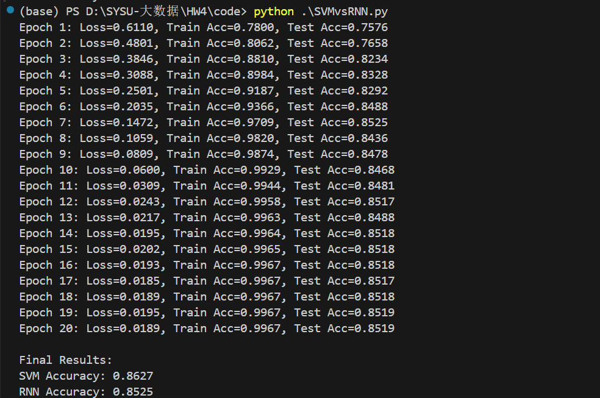

# 作业-4:电影评论情感分类

22331095 王志杰

使用IMDB影评数据集(或其他数据)
使用TF-IDF进行特征提取并用逻辑回归/SVM/RNN实现分类，分析准确率差异

#### **一、实验概述**

本实验基于IMDB影评数据集（50,000条标注评论），采用TF-IDF+SVM与双向LSTM两种方法实现情感分类任务，通过对比模型准确率分析传统机器学习与深度学习方法在文本分类中的性能差异。

#### **二、核心算法设计**

##### **1. TF-IDF + SVM模型**

- **特征提取**：
  使用`TfidfVectorizer`提取TF-IDF特征（维度10,000），计算公式为：TF-IDF(t,d) = TF(t,d) × IDF(t)

  ```
      vectorizer = TfidfVectorizer(max_features=tfidf_features, 
                                 stop_words='english', 
                                 lowercase=True)
  ```

- **分类器**：
  采用线性支持向量机（LinearSVC），通过最大化类别间隔构建超平面，适用于高维稀疏特征

  核心参数：默认正则化系数，特征维度10,000。

  SVM的具体实现和之前的作业类似，不再赘述

##### **2. 双向LSTM模型**

```
class RNNClassifier(nn.Module):
    def __init__(self):
        super().__init__()
        self.embedding = nn.Embedding(num_words, embed_dim)
        self.lstm = nn.LSTM(embed_dim, hidden_dim,
                           num_layers=num_layers,
                           bidirectional=bidirectional,
                           dropout=dropout if num_layers > 1 else 0,
                           batch_first=True)
        self.fc = nn.Linear(hidden_dim * (2 if bidirectional else 1), 1)
        self.dropout = nn.Dropout(dropout)
        
    def forward(self, x, lengths):
        # 嵌入层
        x = self.embedding(x)
        
        # 打包序列
        packed_input = pack_padded_sequence(x, lengths.cpu(), batch_first=True, enforce_sorted=False)
        
        # LSTM层
        packed_output, (hidden, cell) = self.lstm(packed_input)
        
        # 处理双向LSTM
        if bidirectional:
            hidden = torch.cat((hidden[-2], hidden[-1]), dim=1)
        else:
            hidden = hidden[-1]
            
        # 全连接层
        out = self.dropout(hidden)
        return self.fc(out).squeeze()
```

- **Embedding层**：

  将词索引转换为词向量，维度为256。

- **LSTM结构**：

  - 双向LSTM（2层），隐藏层维度128，通过`pack_padded_sequence`处理变长序列
  - 引入Dropout（0.5）防止过拟合，梯度裁剪（max_norm=5）稳定训练

- **输出层**：

  全连接层将LSTM输出映射为二分类结果，使用BCEWithLogitsLoss损失函数。

- **训练优化**：
  - 动态学习率调整（ReduceLROnPlateau）
  - 批量大小128，Adam优化器（lr=1e-3）

------

#### **三、实验结果**



------

#### **四、结果分析**

##### **准确率差异原因**

- **特征表达差异**：
  IMDB评论平均长度285词，SVM的TF-IDF方法能有效捕获关键词特征
- **数据规模限制**：
  深度学习通常需更大数据量（如百万级样本）充分训练，而IMDB仅50k样本可能限制RNN潜力
- **模型复杂度**：
  LSTM更易受噪声干扰（如非规范文本），需更强正则化

##### **总结**

- SVM的线性决策边界在中等规模数据集（25k样本）表现稳定
- LSTM在短文本（<200词）中难以充分体现序列建模优势
- 未使用预训练词向量限制了深度模型的表示能力

**改进的可能**：添加Attention机制增强关键特征捕获，引入数据增强（同义词替换等），调整文本长度分布（截断/分块）
