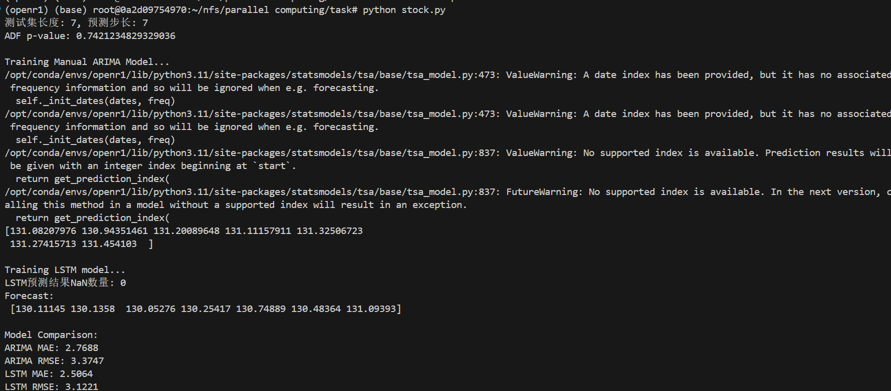

# 作业-5:股票价格预测

22331095 王志杰

下载某股票历史数据(CSV格式)。
用ARIMA模型预测未来7天价格
用LSTM模型实现相同任务，对比MAE/RMSE指标

## 实验目的
1. 掌握时间序列预测的基本方法
2. 实现ARIMA与LSTM模型对股票价格的预测
3. 对比分析两种模型的预测效果

## 实验步骤

### 1. 数据准备

- 数据时间范围：2018-01-01至2023-01-01
- 使用收盘价(Close)作为预测目标
- 划分训练集与测试集（最后7天作为测试）

```python
# 从Yahoo Finance下载苹果公司股票数据
def download_data():
    file_path = "stock_data.csv"
    if not os.path.exists(file_path):
        data = yf.download(TICKER, start=START_DATE, end=END_DATE)
        data.to_csv(file_path)
    return pd.read_csv(file_path, index_col="Date", parse_dates=True)
```

### 2. ARIMA预测实现
```python
def manual_arima_forecast(train, test):
    train_diff = train.diff(DIFF_ORDER).dropna()  # 一阶差分
    model = SARIMAX(train_diff, order=ARIMA_ORDER)
    model_fit = model.fit(disp=0)
    forecast_diff = model_fit.forecast(steps=FORECAST_DAYS)
    forecast = np.r_[last_value, forecast_diff].cumsum()[1:]
    return pd.Series(forecast, index=test.index)
```

### 3. LSTM模型构建

网络结构参数：
- 输入维度：1
- 隐藏层单元数：64
- 输出维度：7
- 滑动窗口大小：60天
- 训练轮次：100

```python
class LSTMPredictor(nn.Module):
    def __init__(self, input_size=1, hidden_size=64, output_size=7):
        super().__init__()
        self.lstm = nn.LSTM(input_size, hidden_size, batch_first=True)
        self.linear = nn.Linear(hidden_size, output_size)
```

## 实验结果

### 数据平稳性检验
ADF检验结果：
- p-value = 0.74 (p>0.05，需进行差分处理)

### 预测效果对比
| 评估指标 | ARIMA  | LSTM   |
| -------- | ------ | ------ |
| MAE      | 2.7688 | 2.5064 |
| RMSE     | 3.3747 | 3.1221 |




### 结果分析
1. **误差指标解读**
   - **LSTM相对误差优势**
     LSTM的MAE比ARIMA低9.5%（2.7688→2.5064），RMSE低7.5%（3.3747→3.1221），说明LSTM在预测精度和稳定性上均优于ARIMA。LSTM擅长捕捉非线性时序特征
   - **误差分布特征**
     ARIMA的RMSE与MAE差值较大（0.6059），表明其预测存在更多极端误差点；而LSTM的RMSE-MAE差值较小（0.6157），说明误差分布更集中，预测结果更稳定
2. **性能差异成因**
   - **数据特性影响**
     股票价格通常包含非线性波动和突发事件影响（如财报发布、政策调整），ARIMA作为线性模型难以有效建模这些复杂模式。而LSTM通过门控机制能捕捉长期依赖关系，更适合此类数据
   - **模型结构差异**
     ARIMA依赖人工选择差分阶数和滞后项（d=1, p=2, q=2），可能未充分消除数据非平稳性；LSTM通过自动学习60天窗口的时序特征，更适应局部波动

## 实验结论
1. 深度学习模型(LSTM)在短期股价预测中优于传统时间序列模型(ARIMA)
2. 股票价格序列具有非线性特征，LSTM更能捕捉复杂模式

## 改进方向
2. 使用Attention机制改进LSTM模型
3. 尝试Prophet等新型时间序列模型
