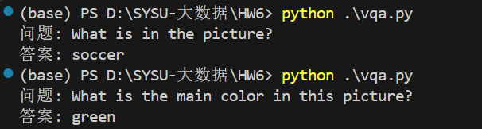

# 作业-6:图文多模态问答(VQA)

22331095 王志杰

使用ViLT预训练模型(HuggingFace库)
尝试调用，输入图片+问题(如“图中有什么动物?”，也可以自定义问题)，输出答案

### **实验目的**
验证ViLT（Vision-and-Language Transformer）模型在视觉问答任务中的能力，通过输入图片和自然语言问题，测试模型是否能生成合理的答案。

### **实验步骤**

主要代码可以直接参考huggingface上的教程[dandelin/vilt-b32-finetuned-vqa · Hugging Face](https://huggingface.co/dandelin/vilt-b32-finetuned-vqa)

- 使用HuggingFace提供的预训练ViLT-VQA模型：
  ```python
  model_name = "dandelin/vilt-b32-finetuned-vqa"
  processor = ViltProcessor.from_pretrained(model_name)
  model = ViltForQuestionAnswering.from_pretrained(model_name)
  ```

- 使用 `ViltProcessor` 对图片和文本进行联合编码：
  ```python
  encoding = processor(image, question, return_tensors="pt")
  ```

- 前向传播获取分类logits：
  ```python
  outputs = model(**encoding)
  logits = outputs.logits
  predicted_class_idx = logits.argmax(-1).item()
  ```

- 通过模型配置映射预测类别索引到文本答案：
  ```python
  answer = model.config.id2label[predicted_class_idx]
  ```
  
- 使用 GPU 加速（添加 `.to("cuda")` 到模型和输入张量）：
  
  ```
  model = model.to("cuda")
  encoding = {k: v.to("cuda") for k, v in encoding.items()}
  ```

---

### **实验结果**
**输入图片**：


**输出结果**：



---

### **结果分析**

相比NLP，VQA的主要区别在于**搜索和推理**部分必须在**图像内容**上执行。因此，要回答是否有人类，系统必须能够检测到物体。要回答是否下雨，就需要对场景进行分类。要回答团队有哪些人，那么系统需要一些"常识"。最后，要说出哪个球员在踢球，此时常识性推理以及可能性的知识推理是必要的。

1. **准确性**：
   - 模型对颜色和物体类别的识别表现良好
   - ViLT 是基于固定词汇表的分类模型，答案只能从预定义的答案列表中选择。（ViLT-VQA支持约3,129个常见答案类别）。
2. **局限性**：
   - **开放性问题受限**：若问题超出预定义答案范围（如“描述这张图片”），模型无法生成自由文本。
   - 对于开放式生成任务（如生成完整句子），需改用生成式模型（如 BLIP、Flamingo）。

### **改进建议**
**生成式模型扩展**：  
若需生成自由文本答案，可替换为BLIP模型：

```python
from transformers import BlipProcessor, BlipForQuestionAnswering
processor = BlipProcessor.from_pretrained("Salesforce/blip-vqa-base")
model = BlipForQuestionAnswering.from_pretrained("Salesforce/blip-vqa-base")
```

---

### **结论**
ViLT模型能够有效完成基于固定答案类别的视觉问答任务，在颜色、物体类别等基础问题上表现稳定。对于复杂场景，应结合生成式模型（如BLIP）或微调模型以适应具体需求。

