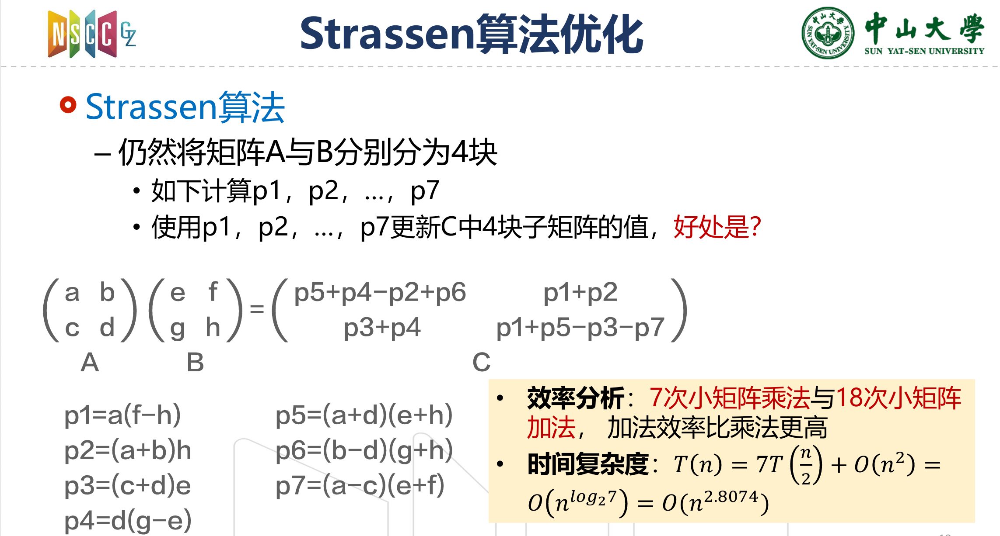

# Lab0-环境设置与串行矩阵乘法

22331095 王志杰

## 背景

矩阵：数学上，一个m×n的矩阵是一个由m行n列元素排列成的矩形阵列。矩阵是高等代数中常见的数学工具，也常见于统计分析等应用数学学科中。矩阵运算是数值分析领域中的重要问题。 
通用矩阵乘法：C=A·B，其中A为m×n的矩阵，B为n×k的矩阵，则其乘积C为m×k的矩阵，C中第i行第j列元素可由矩阵A中第i行向量与矩阵B中第j列向量的内积给出，即：$$ C_{i,j}=\sum_{p=1}^{n}{A_{i,p}B_{p,j}}$$

## 实验要求

请根据以上定义用C/C++语言实现一个串行矩阵乘法，并通过对比实验分析其性能。

### 输入

m, n, k三个整数，每个整数的取值范围均为[512, 2048]

### 问题描述

随机生成m×n的矩阵A及n×k的矩阵B，并对这两个矩阵进行矩阵乘法运算，得到矩阵C.

### 输出

A, B, C三个矩阵，及矩阵计算所消耗的时间t。

### 要求

实现多个版本的串行矩阵乘法（可考虑多种语言/编译选项/实现方式/算法/库），填写下表，并对比分析不同因素对最终性能的影响。版本内容可参考下表中实现描述。

注1：“**相对加速比**”为相对于前一版本的加速比；“**绝对加速比**”为相对于版本1的加速比；“**浮点性能**”可以通过统计程序里面跑了多少次浮点计算，然后除以运行时间得到；“**峰值性能百分比**”为当前浮点性能相对于计算设备峰值性能的百分比。

### 结果

为了统一，我的矩阵大小都为1024*1024，另外固定了随机种子，这样方便检查基于c++优化的结果是否正确

需要提前声明的是，由于矩阵大小过小，计算相对来说并不算密集，如果将矩阵开的足够大比如10000*10000才能达到相对比较高的峰值性能，另外循环展开、strassen使用了编译优化，MKL没有使用

其中，加速比 = 前一版本的运行时间 / 当前版本的运行时间，另外我计算出了设备的理论性能峰值，在c++优化系列程序作为常数填入了

| 版本 |       实现描述        | 运行时间 （msec.） | 相对 加速比 | 绝对 加速比 | 浮点性能 （GFLOPS） | 峰值性能 百分比 |
| :--: | :-------------------: | :----------------: | :---------: | :---------: | :-----------------: | :-------------: |
|  1   | Python(without numpy) |      363.9743      |     ---     |     ---     |        0.01         |      0.00%      |
|  2   |         C/C++         |      24.3420       |   14.96x    |   14.96x    |        0.09         |      0.01%      |
|  3   |     调整循环顺序      |      17.8976       |    1.36x    |   20.34x    |        0.12         |      0.01%      |
|  4   |       编译优化        |       0.5471       |   32.68x    |   665.29x   |        3.92         |      0.31%      |
|  5   |       循环展开        |       1.2770       |    2.33x    |   285.26x   |        1.68         |      0.13%      |
|  6   |       Strassen        |       0.9591       |    1.33x    |   379.42x   |        2.24         |      0.18%      |
|  7   |       Intel MKL       |       0.0852       |   11.26x    |  4273.43x   |        25.21        |      1.99%      |
|  8   |  Python(with numpy)   |       0.0710       |    1.20x    |  5126.83x   |        30.26        |      2.39%      |

## 实验过程

### 1. 环境配置

我遇到了这个问题

```
./example: symbol lookup error: /opt/intel/oneapi/mkl/2025.0/lib/libmkl_intel_thread.so.2: undefined symbol: omp_get_num_procs
```

这是因为链接阶段没有正确链接OpenMP库，我的解决方法如下：

```
# 1. 安装 Intel OpenMP 库
apt update && apt install intel-oneapi-openmp -y

# 2. 加载 Intel 环境变量（确保库路径生效）
source /opt/intel/oneapi/setvars.sh

# 3. 重新编译并链接 OpenMP
gcc example.c -o example -lmkl_rt -liomp5

# 4. 运行程序
./example
```

### 2. 计算过程

设备的理论计算峰值：我使用的是课题组的服务器进行计算，CPU为 Intel(R) Xeon(R) CPU E5-2678 v3 @ 2.50GHz，在Intel官网上查不到这款CPU的GFLOPS指标，于是我自己计算，使用了这样的公式去计算（实际程序中进行了单位换算，这里只是伪代码）

```
theoretical_peak = physical_cores * base_freq * flops_per_cycle
```

其中flops_per_cycle由指令集决定，这款CPU支持AVX2，所以flops_per_cycle为16

理论峰值经过计算得到1267.20 GFLOPS

#### 2.2.1 python

python的程序我实现了两个版本，分为使用和不使用numpy的版本

实际运算的GFLOPS的计算公式是 2 * m * n * k / comput_time

不使用numpy优化的python版本峰值性能百分比极低，远低于0.01%

```
        for i in range(m):
            for j in range(k):
                for p in range(n):
                    C[i][j] += A[i][p] * B[p][j]
```

使用numpy优化的版本，参数都设置为1024时实际达到的性能占比比较低，但是如果都改为10000的话占用理论峰值百分比能达到70%

```
		C = np.dot(A, B)
```

以上，这是由于矩阵乘法需要频繁访问矩阵元素，大矩阵计算密集度更高，能够更好地利用CPU的计算资源和缓存优化，而小矩阵计算可能受限于内存访问和线程调度开销。（numpy的底层依赖BLAS和LAPACK库，而这些库的实现是多线程优化的）

#### 2.2.2 c++

同样的固定了种子，然后将理论峰值作为常数带入，能看到明显比不做任何优化的原生python要快，虽然也只达到了理论峰值的0.01%

```
    for (int i = 0; i < m; ++i) {
        for (int j = 0; j < k; ++j) {
            for (int p = 0; p < n; ++p) {
                C[i][j] += A[i][p] * B[p][j];
            }
        }
    }
```

#### 2.2.3 调整循环顺序

按行访问矩阵B可以更好地利用CPU缓存，减少缓存缺失。gflops有了一定的提升

```
    for (int i = 0; i < m; ++i) {
        for (int p = 0; p < n; ++p) { // 调整循环顺序
            for (int j = 0; j < k; ++j) {
                C[i][j] += A[i][p] * B[p][j];
            }
        }
    }
```

#### 2.2.4 编译优化

主要的改进是换用了这个命令去编译

```
g++ -Ofast matrix_loop_unwinding.cpp -o matrix_compile_optim
```

编译优化显著提高了运算速度，Ofast会启用`-O3`的所有优化并启用`-ffast-math`

#### 2.2.4 循环展开

选择最内层j循环展开，能最大程度减少循环控制开销，主要改动如下：

```
    for (int i = 0; i < m; ++i) {
        for (int p = 0; p < n; ++p) { // 调整循环顺序
            int j = 0;
            for (; j < k - 3; j+=4) {
                C[i][j] += A[i][p] * B[p][j];
                C[i][j+1] += A[i][p] * B[p][j+1];
                C[i][j+2] += A[i][p] * B[p][j+2];
                C[i][j+3] += A[i][p] * B[p][j+3];
            }
            for (; j < k; ++j) {
                C[i][j] += A[i][p] * B[p][j];
            }
        }
    }
```

循环展开之后再使用Ofast进行编译，结果发现效果不如不展开循环直接Ofast编译好，这是因为`Ofast`选项已包含自动循环展开优化，手动展开可能破坏编译器原有的优化策略，导致生成的指令流水线效率降低

#### 2.2.5 strassen

strassen基于分治策略，将原始矩阵划分为更小的子矩阵，并使用递归的方式进行计算。strassen算法通过减少乘法运算的次数，从而降低了计算的时间复杂度。



实际上，strassen是面向两个大小相同的方阵去优化的，因此输入参数时最好输入三个大小相同的2的幂，但是考虑到其他可能输入不同参数的情况，我对参数进行了判断，如果不同则进行填充再计算

```
// Strassen算法实现（递归部分）
vector<vector<double>> strassen_recursive(const vector<vector<double>>& A, const vector<vector<double>>& B) {
    int n = A.size();

    // 基本情况：使用传统矩阵乘法
    if (n <= 128) {
        vector<vector<double>> C(n, vector<double>(n, 0.0));
        for (int i = 0; i < n; ++i) {
            for (int k = 0; k < n; ++k) {
                for (int j = 0; j < n; ++j) {
                    C[i][j] += A[i][k] * B[k][j];
                }
            }
        }
        return C;
    }

    // 分治法
    int half = n / 2;
    vector<vector<double>> A11(half, vector<double>(half));
    vector<vector<double>> A12(half, vector<double>(half));
    vector<vector<double>> A21(half, vector<double>(half));
    vector<vector<double>> A22(half, vector<double>(half));
    vector<vector<double>> B11(half, vector<double>(half));
    vector<vector<double>> B12(half, vector<double>(half));
    vector<vector<double>> B21(half, vector<double>(half));
    vector<vector<double>> B22(half, vector<double>(half));

    // 分割矩阵
    for (int i = 0; i < half; ++i) {
        for (int j = 0; j < half; ++j) {
            A11[i][j] = A[i][j];
            A12[i][j] = A[i][j + half];
            A21[i][j] = A[i + half][j];
            A22[i][j] = A[i + half][j + half];
            B11[i][j] = B[i][j];
            B12[i][j] = B[i][j + half];
            B21[i][j] = B[i + half][j];
            B22[i][j] = B[i + half][j + half];
        }
    }

    // 创建临时矩阵用于存储中间结果
    vector<vector<double>> temp1(half, vector<double>(half));
    vector<vector<double>> temp2(half, vector<double>(half));

    // 计算中间结果
    subtract_matrices(B12, B22, temp1);
    vector<vector<double>> M1 = strassen_recursive(A11, temp1);

    add_matrices(A11, A12, temp1);
    vector<vector<double>> M2 = strassen_recursive(temp1, B22);

    add_matrices(A21, A22, temp1);
    vector<vector<double>> M3 = strassen_recursive(temp1, B11);

    subtract_matrices(B21, B11, temp1);
    vector<vector<double>> M4 = strassen_recursive(A22, temp1);

    add_matrices(A11, A22, temp1);
    add_matrices(B11, B22, temp2);
    vector<vector<double>> M5 = strassen_recursive(temp1, temp2);

    subtract_matrices(A12, A22, temp1);
    add_matrices(B21, B22, temp2);
    vector<vector<double>> M6 = strassen_recursive(temp1, temp2);

    subtract_matrices(A11, A21, temp1);
    add_matrices(B11, B12, temp2);
    vector<vector<double>> M7 = strassen_recursive(temp1, temp2);

    // 计算结果矩阵的四个部分
    vector<vector<double>> C11(half, vector<double>(half));
    vector<vector<double>> C12(half, vector<double>(half));
    vector<vector<double>> C21(half, vector<double>(half));
    vector<vector<double>> C22(half, vector<double>(half));

    // 计算 C11 = M5 + M4 - M2 + M6
    add_matrices(M5, M4, C11);
    subtract_matrices(C11, M2, C11);
    add_matrices(C11, M6, C11);

    // 计算 C12 = M1 + M2
    add_matrices(M1, M2, C12);

    // 计算 C21 = M3 + M4
    add_matrices(M3, M4, C21);

    // 计算 C22 = M5 + M1 - M3 - M7
    add_matrices(M5, M1, C22);
    subtract_matrices(C22, M3, C22);
    subtract_matrices(C22, M7, C22);

    // 合并结果矩阵
    vector<vector<double>> C(n, vector<double>(n));
    for (int i = 0; i < half; ++i) {
        for (int j = 0; j < half; ++j) {
            C[i][j] = C11[i][j];
            C[i][j + half] = C12[i][j];
            C[i + half][j] = C21[i][j];
            C[i + half][j + half] = C22[i][j];
        }
    }

    return C;
}

// Strassen算法实现
vector<vector<double>> strassen(const vector<vector<double>>& A, const vector<vector<double>>& B, int m, int n, int k) {
    // 检查是否为相同大小的方阵
    if (m == n && n == k) {
        // 直接使用Strassen算法
        return strassen_recursive(A, B);
    } else {
        // 计算新的矩阵大小，使其为2的幂次方
        int new_size = 1;
        while (new_size < max(m, max(n, k))) {
            new_size *= 2;
        }

        // 填充矩阵到新的大小
        vector<vector<double>> A_padded = pad_matrix(A, new_size, new_size);
        vector<vector<double>> B_padded = pad_matrix(B, new_size, new_size);

        // 使用Strassen算法计算填充后的矩阵乘法
        vector<vector<double>> C_padded = strassen_recursive(A_padded, B_padded);

        // 提取原始大小的矩阵乘法结果
        vector<vector<double>> C(m, vector<double>(k, 0.0));
        for (int i = 0; i < m; ++i) {
            for (int j = 0; j < k; ++j) {
                C[i][j] = C_padded[i][j];
            }
        }

        return C;
    }
}
```

使用7×(*n*log27)近似计算strassen的GFLOPS，再进行Ofast编译，但是最后得到的结果性能还是不如不做优化，直接Ofast编译的好（Ofast真的很强大啊），这可能是因为传统方法的循环结构更易于被编译器优化，比如循环展开、向量化等，另外Strassen 算法由于其复杂的子矩阵操作，可能导致更多的缓存缺失

#### 2.2.6 MKL

`cblas_dgemm` 执行的矩阵乘法操作可以表示为： *C*=*α*×*A*×*B*+*β*×*C* 其中：

- *α* 是乘法的标量系数（在这里为1.0）。
- *β* 是加法的标量系数（在这里为0.0）。
- *A* 和 *B* 是输入矩阵。
- *C* 是输出矩阵。

`cblas_dgemm` 执行的是： *C*=1.0×*A*×*B*+0.0×*C* ，这等价于： *C*=*A*×*B*

```
    // 使用MKL的cblas_dgemm函数进行矩阵乘法
    double alpha = 1.0;
    double beta = 0.0;
    cblas_dgemm(CblasRowMajor, CblasNoTrans, CblasNoTrans,
                m, n, k,
                alpha, A_data.data(), k,
                B_data.data(), n,
                beta, C_data.data(), n);
```

这次意外的发现，不做ofast直接编译跑的更快。这是因为`-Ofast`选项会启用非常激进的编译器优化，这些优化可能会与MKL的内部实现产生冲突或不兼容。例如，`-Ofast`可能会改变浮点运算的精度或顺序，或者改变内存分配的方式，导致对齐不优化，从而影响MKL的性能