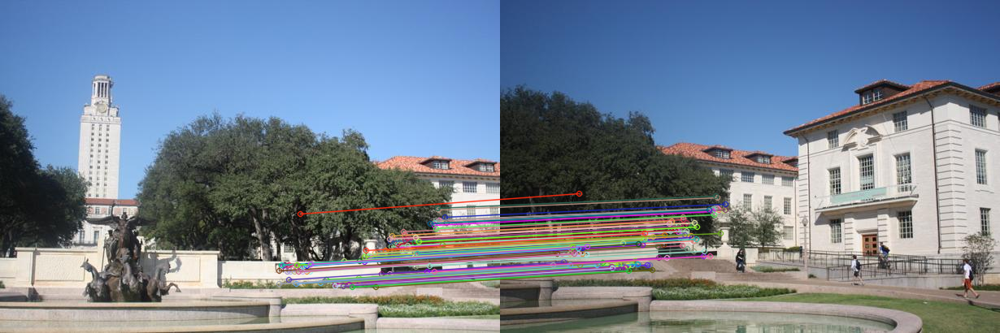

# 模式识别实验一报告：全景图拼接 

22331095王志杰

## 实验目的
1. 熟悉Harris角点检测器的原理和基本使用  
2. 熟悉RANSAC抽样一致方法的使用场景  
3. 熟悉HOG描述子的基本原理  

## 实验要求
1. 提交包含适当步骤说明和结果分析的实验报告  
2. 打包提交代码和实验结果  
3. 允许使用现有特征描述子实现  

## 实验内容
### 1. Harris角点检测
#### 算法原理
Harris角点响应函数：
$$
R = \det(M) - k \cdot (\text{trace}(M))^2
$$
其中结构张量$M = \begin{bmatrix}
I_x^2 & I_xI_y \\
I_xI_y & I_y^2
\end{bmatrix}$，$I_x$和$I_y$为图像梯度

#### 实现步骤
1. 计算图像梯度
2. 构建结构张量分量
3. 高斯滤波消除噪声
4. 计算角点响应值
5. 非极大值抑制
6. 阈值处理提取角点

#### 实现代码

```
# Harris角点检测实现
def harris_corner_detector(img_path, output_path, threshold=0.01, k=0.04, window_size=3, gaussian_sigma=1.0):
    # 读取图像并转为灰度
    img = cv2.imread(img_path)
    gray = cv2.cvtColor(img, cv2.COLOR_BGR2GRAY)
    gray = np.float32(gray)
    
    # 计算梯度
    Ix = cv2.Sobel(gray, cv2.CV_64F, 1, 0, ksize=3)
    Iy = cv2.Sobel(gray, cv2.CV_64F, 0, 1, ksize=3)
    
    # 计算各分量
    Ix2 = Ix ** 2
    Iy2 = Iy ** 2
    Ixy = Ix * Iy
    
    # 高斯滤波
    Ix2 = cv2.GaussianBlur(Ix2, (window_size, window_size), gaussian_sigma)
    Iy2 = cv2.GaussianBlur(Iy2, (window_size, window_size), gaussian_sigma)
    Ixy = cv2.GaussianBlur(Ixy, (window_size, window_size), gaussian_sigma)
    
    # 计算角点响应函数
    det = Ix2 * Iy2 - Ixy ** 2
    trace = Ix2 + Iy2
    R = det - k * (trace ** 2)
    
    # 非极大值抑制
    R_max = cv2.dilate(R, None)
    mask = (R == R_max)
    R = R * mask
    
    # 阈值处理
    R[R < threshold * R.max()] = 0
    
    # 获取角点坐标
    corners = np.argwhere(R > 0)
    
    # 在原图上绘制角点
    img_out = img.copy()
    for y, x in corners:
        cv2.circle(img_out, (x, y), 3, (0, 0, 255), -1)
    
    cv2.imwrite(output_path, img_out)
    return corners
```

#### 实验结果
  
图1 棋盘格角点检测结果

  
图2 钟楼图像1角点检测

  
图3 钟楼图像2角点检测

#### 参考

[Harris 角点检测 - SLAM 之旅](https://lsxiang.github.io/Journey2SLAM/computer_vision/Harris/)

### 2. 特征描述与匹配
#### SIFT描述子

- 基于尺度空间极值检测
- 128维梯度方向直方图
- 具有旋转和尺度不变性
- 通过高斯金字塔进行尺度归一化检测
- 参考https://developer.aliyun.com/article/1208077

```
# 直接调用opencv封装的SIFT描述子
sift = cv2.SIFT_create()
kp1_sift, des1 = sift.compute(gray1, kp1)
kp2_sift, des2 = sift.compute(gray2, kp2)
```

#### HOG描述子
- 局部梯度方向统计直方图，利用归一化块进行特征表达。

- 核心原理

  1.  关键点提取与边界处理
     - 输入：灰度图像 `gray_img` 和关键点 `keypoints`，每个关键点是 `(y, x)` 坐标。
     - 计算 **特征提取区域大小**：使用 `cell_size` 和 `block_size`，定义一个局部区域，大小为 `cell_size * block_size`，即 `half_size = cell_size * block_size // 2`。
     - 如果关键点靠近边缘，无法完整提取特征区域，则填充零向量，防止越界错误。

  2. 计算局部梯度信息

     - 提取关键点周围的 `patch`（局部图像区域）。

     - 计算 **x 方向和 y 方向的梯度**：
       - `gx = cv2.Sobel(patch, cv2.CV_32F, 1, 0)` 计算水平方向梯度。
         - `gy = cv2.Sobel(patch, cv2.CV_32F, 0, 1)` 计算垂直方向梯度。
         - `mag = np.sqrt(gx**2 + gy**2)` 计算梯度幅值。
         - `ang = np.arctan2(gy, gx) * (180 / np.pi) % 180` 计算梯度方向，并将角度转换到 `[0, 180]` 范围。

  3. 计算 HOG 直方图

     - 对局部区域划分成 `cell_size × cell_size` 的小单元。

     - 在每个 cell 内计算方向直方图：
       - 方向角 `ang` 和对应的梯度幅值 `mag` 被分配到 `nbins` 个直方图桶。
         - 使用 `bin_idx = int(a // (180 / nbins)) % nbins` 确定角度落入的直方图桶。
         - 幅值 `mag` 作为权重累加到相应的直方图桶中。

     - **归一化**：HOG 直方图进行 L2 归一化 `hist /= np.linalg.norm(hist) + 1e-5`，避免梯度过大影响匹配。

- 参考[计算机视觉基础：HOG特征描述算⼦ - 知乎](https://zhuanlan.zhihu.com/p/156032691)，[【特征检测】HOG特征算法_比较两幅图像相似性-基于hog特征-CSDN博客](https://blog.csdn.net/hujingshuang/article/details/47337707)

```
def compute_hog_descriptor(gray_img, keypoints, cell_size=8, block_size=2, nbins=9):
    descriptors = []
    for kp in keypoints:
        x, y = int(kp[1]), int(kp[0])  # Harris返回的是(y,x)
        half_size = cell_size * block_size // 2
        
        # 边界处理
        if x < half_size or x >= gray_img.shape[1] - half_size or y < half_size or y >= gray_img.shape[0] - half_size:
            descriptors.append(np.zeros((block_size**2 * nbins), dtype=np.float32))
            continue
        
        # 提取局部区域
        patch = gray_img[y-half_size:y+half_size, x-half_size:x+half_size]
        
        # 计算梯度
        gx = cv2.Sobel(patch, cv2.CV_32F, 1, 0)
        gy = cv2.Sobel(patch, cv2.CV_32F, 0, 1)
        mag = np.sqrt(gx**2 + gy**2)
        ang = np.arctan2(gy, gx) * (180 / np.pi) % 180
        
        descriptor = []
        for i in range(0, patch.shape[0], cell_size):
            for j in range(0, patch.shape[1], cell_size):
                cell_ang = ang[i:i+cell_size, j:j+cell_size]
                cell_mag = mag[i:i+cell_size, j:j+cell_size]
                hist = np.zeros(nbins)
                for a, m in zip(cell_ang.flatten(), cell_mag.flatten()):
                    bin_idx = int(a // (180 / nbins)) % nbins
                    hist[bin_idx] += m
                hist /= np.linalg.norm(hist) + 1e-5  # 归一化
                descriptor.extend(hist)
        descriptors.append(np.array(descriptor,dtype=np.float32))
    return np.array(descriptors)
```

### 3. RANSAC仿射变换
#### 算法流程
1. 随机抽取匹配点对，找到good match
2. 计算仿射变换矩阵
3. 统计内点数量
4. 迭代优化最佳变换

仿射变换模型：
$$
\begin{bmatrix}
x' \\ 
y'
\end{bmatrix} = 
\begin{bmatrix}
a & b & c \\
d & e & f
\end{bmatrix}
\begin{bmatrix}
x \\
y \\
1
\end{bmatrix}
$$

#### 实现

```
def match_and_draw(des1, des2, kp1, kp2, img1, img2, output_path):
    bf = cv2.BFMatcher(cv2.NORM_L2,crossCheck=True)
    matches = bf.match(des1, des2)
    matches = sorted(matches, key=lambda x: x.distance)[:100]  # 取前100个最佳匹配
    
    # 绘制匹配结果
    matched_img = cv2.drawMatches(img1, kp1, img2, kp2, matches, None, flags=2)
    cv2.imwrite(output_path, matched_img)
    
    # RANSAC计算变换矩阵
    src_pts = np.float32([kp1[m.queryIdx].pt for m in matches]).reshape(-1, 2)
    dst_pts = np.float32([kp2[m.trainIdx].pt for m in matches]).reshape(-1, 2)
    
    M, mask = cv2.estimateAffine2D(src_pts, dst_pts, method=cv2.RANSAC, ransacReprojThreshold=5.0)
    inliers = mask.ravel().tolist()
    
    # 绘制内点匹配
    good_matches = [m for m, i in zip(matches, inliers) if i]
    good_img = cv2.drawMatches(img1, kp1, img2, kp2, good_matches, None, flags=2)
    cv2.imwrite(output_path.replace('.png', '_good.png'), good_img)
    
    # 拼接图像
    if len(good_matches) >= 3:  # 仿射变换至少需要3个点
        src_pts_good = np.float32([kp1[m.queryIdx].pt for m in good_matches]).reshape(-1, 2)
        dst_pts_good = np.float32([kp2[m.trainIdx].pt for m in good_matches]).reshape(-1, 2)
        
        # 使用good_matches计算仿射变换矩阵
        M_good, mask_good = cv2.estimateAffine2D(src_pts_good, dst_pts_good,
                                                 method=cv2.RANSAC, ransacReprojThreshold=5.0)
        # 如果变换矩阵计算成功，则用它来拼接图像
        if M_good is not None:
            stitched = stitch_images(img1, img2, M_good)
            cv2.imwrite(output_path.replace('_match_', '_stitching_'), stitched)
            return M_good
    return None
```

#### 匹配结果对比

| 特征类型 | 匹配结果图                                | 拼接结果                                      |
| -------- | ----------------------------------------- | --------------------------------------------- |
| SIFT     |  |  |
| HOG      |   |   |

**差异分析**：

1. 尺度鲁棒性：SIFT通过尺度空间检测特征，HOG在固定窗口计算

2. 旋转不变性：SIFT主方向归一化，HOG对方向敏感

3. 匹配准确率：SIFT匹配点分布更均匀，HOG易受视角变化影响

4. SIFT 更适用于不同尺度和旋转角度的图像，匹配效果较好。

   HOG 对局部纹理较敏感，但不具有尺度不变性，匹配精度稍差。

5. SIFT+RANSAC 能够较好地对齐图像，使拼接效果更自然。

   特征匹配点较多时，拼接效果更稳定。

#### 参考

https://blog.csdn.net/zhoucoolqi/article/details/105497572

### 4. 多图拼接（SIFT）

#### 实现方法

1. 基准图选择：首张图像作为初始基准
2. 增量拼接：依次将后续图像与当前全景图对齐
3. 图像融合：简单覆盖策略

#### 实现代码

```
def multi_stitch(image_paths, output_path):
    base_img = cv2.imread(image_paths[0])
    for path in image_paths[1:]:
        img = cv2.imread(path)
        gray_base = cv2.cvtColor(base_img, cv2.COLOR_BGR2GRAY)
        gray_new = cv2.cvtColor(img, cv2.COLOR_BGR2GRAY)
        
        # 检测SIFT特征
        sift = cv2.SIFT_create()
        kp1, des1 = sift.detectAndCompute(gray_base, None)
        kp2, des2 = sift.detectAndCompute(gray_new, None)
        # des1 = np.array(des1, dtype=np.float32)
        # des2 = np.array(des2, dtype=np.float32)

        # print(des1.shape, des2.shape)
        # 匹配特征
        bf = cv2.BFMatcher(cv2.NORM_L2)
        matches = bf.knnMatch(des1, des2, k=2)
        good = []
        for m, n in matches:
            if m.distance < 0.75 * n.distance:
                good.append(m)
        
        if len(good) > 10:
            src_pts = np.float32([kp1[m.queryIdx].pt for m in good]).reshape(-1, 2)
            dst_pts = np.float32([kp2[m.trainIdx].pt for m in good]).reshape(-1, 2)
            M, _ = cv2.estimateAffine2D(src_pts, dst_pts, method=cv2.RANSAC, ransacReprojThreshold=5.0)
            
            if M is not None:
                base_img = stitch_images(base_img, img, M)
    
    cv2.imwrite(output_path, base_img)
```

#### 拼接结果
  
图4 全景拼接结果

## 实验分析

- Harris 角点检测器可以有效检测角点，但需配合描述子使用。
- SIFT 适用于不同尺度和旋转角度的匹配，拼接效果最佳。
- HOG 适用于纹理特征匹配，但缺乏尺度不变性。
- RANSAC 能够有效去除异常匹配，提高拼接稳定性。
- 累积误差：多图拼接时仿射变换误差会逐级累积

## 改进方向
1. 使用透视变换代替仿射变换
2. 加入图像融合算法消除接缝
3. 采用全局优化方法减少累积误差

## 
### 