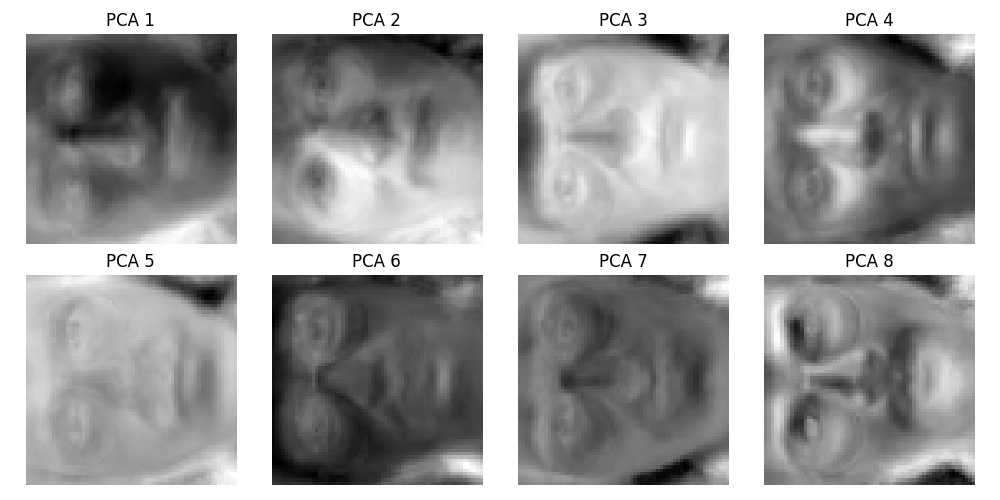
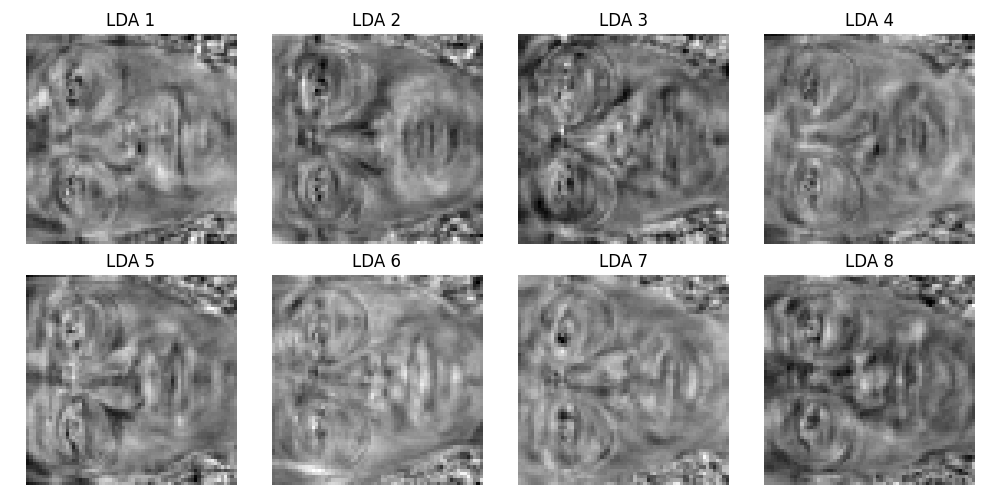
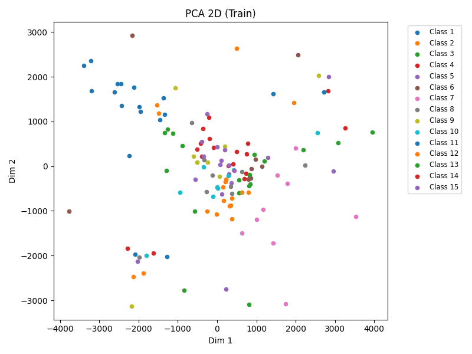
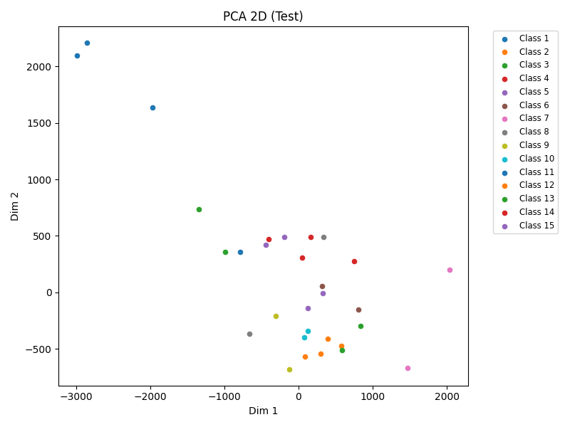
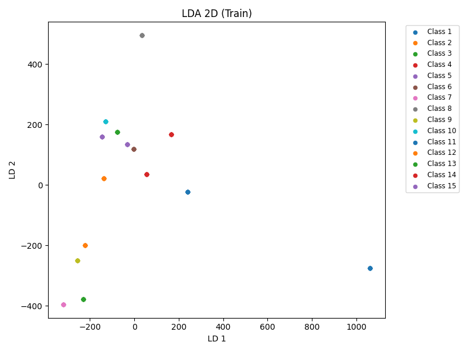
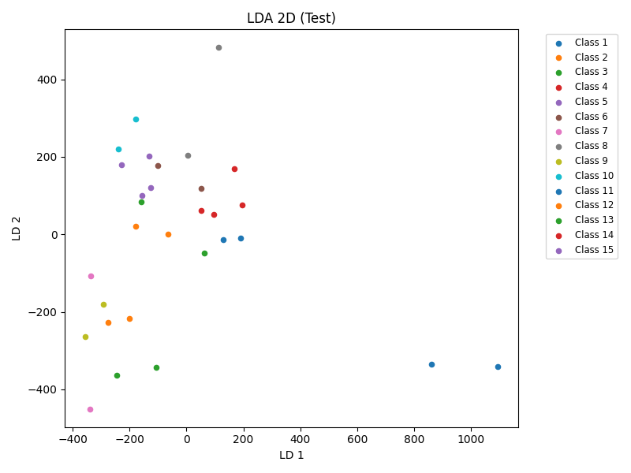
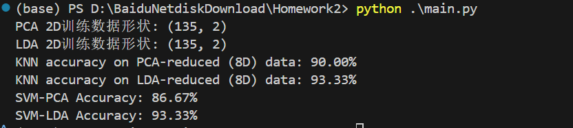

# 实验二 基于 PCA/LDA 和 KNN 的人脸识别实验报告

22331095 王志杰

## 一、实验目的  
1. 掌握主成分分析（PCA）和线性判别分析（LDA）的基本原理，实现数据降维算法。  
2. 实现 k-近邻（KNN）分类器，评估降维后数据的分类性能。  
3. 对比 PCA 和 LDA 在特征提取与分类效果上的差异，并探索支持向量机（SVM）的性能提升。  

---

## 二、实验内容  
1. **数据预处理**：加载 Yale 人脸数据集（15 类，每类 11 张图像），按每类 9 张训练、2 张测试划分数据集。  
2. **算法实现**：  
   - 自主实现 PCA、LDA 和 KNN 算法（不调用库函数接口）。  
   - 利用 PCA 和 LDA 将数据分别降维至 8 维和 2 维。  
3. **可视化分析**：  
   - 显示 PCA 的前 8 个特征向量（特征脸）和 LDA 的判别方向。  
   - 绘制 2 维降维后的数据分布散点图。  
4. **性能评估**：  
   - 使用 KNN 和 SVM 在降维后的数据上测试分类准确率。  

---

## 三、实验步骤  

### 1. 数据加载与预处理  
- **数据集**：Yale 64x64 人脸数据集，包含 165 张图像（15 类，每类 11 张）。  
- **划分方式**：每类前 9 张为训练集（共 135 张），后 2 张为测试集（共 30 张）。  
- **关键代码**：  
  ```python
  def load_data(mat_path):
      data = io.loadmat(mat_path)
      fea = data['fea'].reshape(-1, 11, 4096)  # 数据形状: (15, 11, 4096)
      train_data = fea[:, :9, :].reshape(-1, 4096)
      test_data = fea[:, 9:, :].reshape(-1, 4096)
      return train_data, test_data
  ```

---

### 2. PCA 算法实现  
- **核心步骤**：  
  1. 中心化数据，计算协方差矩阵。  
  2. 特征分解协方差矩阵，选取前 `n_components` 个特征向量作为投影方向。  
- **关键代码**：  
  ```python
  class PCA:
      def fit(self, X):
          self.mean_ = np.mean(X, axis=0)
          X_centered = X - self.mean_
          cov = np.cov(X_centered, rowvar=False)
          eigvals, eigvecs = np.linalg.eigh(cov)
          self.components_ = eigvecs[:, :self.n_components]
  ```

---

### 3. LDA 算法实现与改进
- **初始实现中出现的问题**：  
  
  - **小样本问题**：训练样本数（9）远小于特征维度（4096），导致类内散度矩阵 `S_w` 奇异。  
  - **特征值计算错误**：未处理复数特征值，导致投影方向错误。  
  - 最终导致，LDA降维情况下，KNN分类的正确率极低
- **改进方案**：  
  
  1. 添加正则化项 `S_w += 1e-4 * I` 解决奇异性。  
  2. 使用伪逆 `np.linalg.pinv(S_w)` 提高数值稳定性。  
  3. 仅保留特征值的实部并按降序排序。  
- **关键代码**：  
  ```python
  class LDA:
      def fit(self, X, y):
          S_w += 1e-4 * np.eye(S_w.shape[0])  # 正则化
          S_w_pinv = np.linalg.pinv(S_w)
          eigvals, eigvecs = np.linalg.eig(S_w_pinv @ S_b)
          eigvals = np.real(eigvals)
          self.scalings_ = eigvecs[:, idx[:self.n_components]]
  ```

---

### 4. KNN 与 SVM 分类器  
- **KNN 实现**：基于欧氏距离和多数投票法预测类别。  
- **SVM 调优**：通过网格搜索优化核函数和正则化参数。  
- **关键代码**：  
  ```python
  class KNN:
      def predict(self, X):
          dists = np.linalg.norm(self.X_train - x, axis=1)
          nearest_labels = self.y_train[idx]
          return np.argmax(np.bincount(nearest_labels))
  
  def svm_experiment(X_train, X_test):
      param_grid = {'C': [0.1, 1, 10], 'kernel': ['linear', 'rbf']}
      svm = GridSearchCV(SVC(), param_grid).fit(X_train, y_train)
      return svm.score(X_test, y_test)
  ```

---

## 四、实验结果与分析  

### 1. 降维可视化结果  
- **特征向量可视化**：  
  - PCA 特征脸反映光照和面部轮廓变化。  
  - 
  - LDA 判别方向体现类别区分性。  
  - 
- **2D 散点图**：  
  - **PCA**：数据分布范围广，类别间重叠较多。  
  - 
  - **LDA**：同类数据点聚集，不同类分离明显。  
  - 

---

### 2. 分类准确率对比  
| 降维方法 | 维度 | KNN 准确率 | SVM 准确率 |
| -------- | ---- | ---------- | ---------- |
| PCA      | 8    | 90.00%     | 86.67%     |
| LDA      | 8    | 93.33%     | 93.33%     |

- **分析**：  
  - **PCA**：保留全局方差，适合无监督场景，KNN 准确率较高。  
  - **LDA**：修复后准确率显著提升（从 36.67% → 93.33%），表明其能有效捕捉判别信息。  
  - **SVM**：通过核技巧处理非线性数据，但Yale 数据集每类仅 9 个训练样本，SVM 在高维空间可能难以泛化。另外SVM的超参可能还有优化配置的可能，因此表现略弱于KNN



---

## 五、结论  
1. **算法对比**：  
   - PCA 适用于无监督降维，LDA 在解决小样本问题后分类性能更优。  
   - SVM 通过参数调优可提升准确率。  
2. **改进方向**：  
   - 结合 PCA 预降维（如 100 维）与 LDA，进一步提升稳定性。  
   - 探索深度学习模型（如 CNN）处理原始高维图像。  

---

## 附：代码与结果  
- **代码文件**：`PCA.py`, `LDA.py`, `KNN.py`, `main.py`  
- **结果文件**：特征脸、散点图。  

