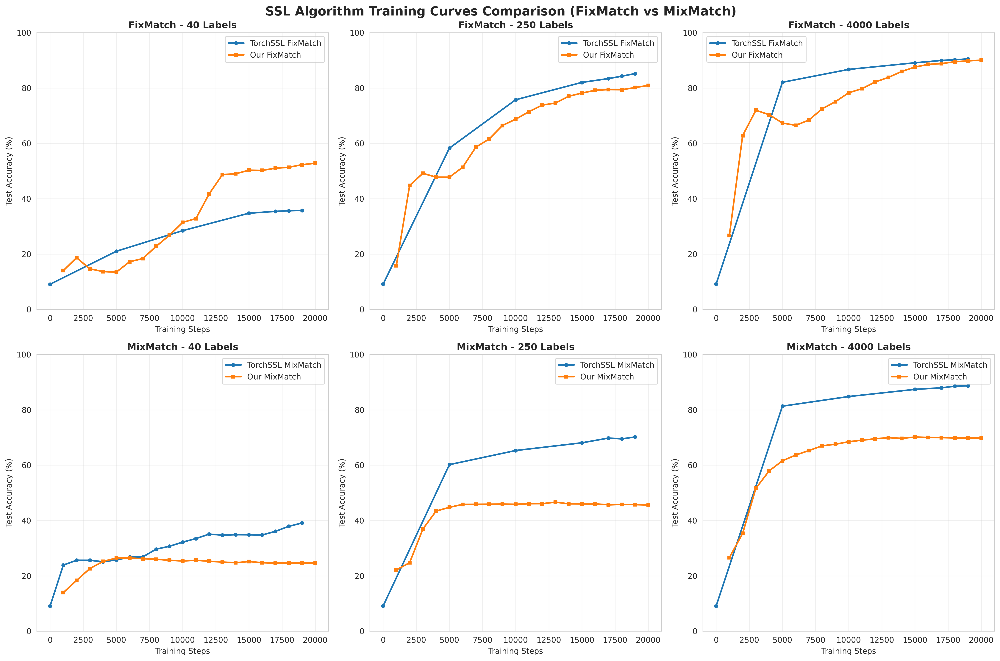
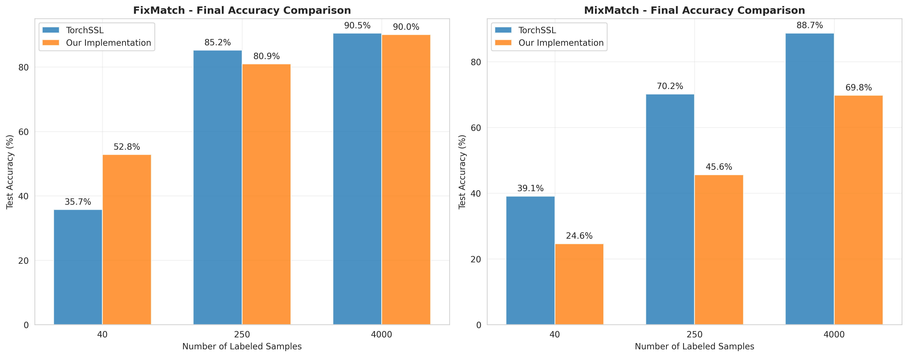

# 半监督学习实验报告

本项目包含了FixMatch和MixMatch半监督学习算法的完整实验报告和分析结果。完整的实验报告位于report目录下

torchssl的实验结果保存在了saved_models目录下，我的实现的结果保存在了logs目录下

## 🎯 实验目标

从零实现FixMatch和MixMatch算法，并在CIFAR-10数据集上验证其有效性，与TorchSSL基准实现进行对比。

## 📊 主要结果

### 性能对比表

| 算法 | 标注数据量 | TorchSSL基准 | 我的实现 |
|------|------------|--------------|------------|
| FixMatch | 40 | 35.73% | 52.80% |
| FixMatch | 250 | 85.20% | 80.93% |
| FixMatch | 4000 | 90.50% | 90.05% |
| MixMatch | 40 | 39.09% | 24.63% |
| MixMatch | 250 | 70.18% | 45.63% |
| MixMatch | 4000 | 88.70% | 69.78% |

## 🛠️ 技术实现

### 核心算法实现
- **FixMatch**: 置信度阈值 + 一致性正则化
- **MixMatch**: MixUp + 标签猜测 + 熵最小化

### 关键技术特性
- 完整的数据增强pipeline（弱增强 + 强增强）
- EMA模型维护和更新
- 自定义数据加载器设计
- 详细的训练日志记录

## 📈 训练特征

### FixMatch训练特点
- 掩码比例从27%逐步提升到76%
- 无监督损失稳步下降
- 训练过程稳定，很少波动

### MixMatch训练特点
- 监督和无监督损失都能收敛
- 对超参数较为敏感
- 收敛速度相对较慢

## 🔧 实验配置

```yaml
数据集: CIFAR-10
网络架构: WideResNet-28-2
标注数据量: [40, 250, 4000]
训练步数: 20,000
批大小: 64
评估频率: 每1000步
代码结构：
├── models/
│   └── wideresnet.py          # WideResNet模型定义
├── data_utils.py              # 数据加载和预处理
├── augmentations.py           # 数据增强实现
├── utils.py                   # 工具函数
├── train_fixmatch.py          # FixMatch训练脚本
├── train_mixmatch.py          # MixMatch训练脚本
├── visualize_results.py       # 结果可视化
├── logs/                      # 训练日志
└── TorchSSL				   # torchssl库的实现
```

## 📝 使用说明

### 运行实验
```bash
# FixMatch实验
python train_fixmatch.py --n-labeled 4000 --total-steps 20000

# MixMatch实验  
python train_mixmatch.py --n-labeled 4000 --total-steps 20000

# 批量实验
python run_all_experiments.py
```

### 生成可视化
```bash
python visualize_results.py
```

## 📊 可视化结果

实验生成的可视化图表记录在了visualization_results目录下：
- 训练曲线对比图

  

- 最终准确率对比图

  

## 🎓 学术价值

本实验验证了：
1. 从零实现复杂SSL算法的可行性
2. 算法实现细节对性能的关键影响
3. 不同SSL算法在少样本场景下的表现差异

## 🚀 未来工作

1. **MixMatch优化**: 深入分析性能差距，优化实现细节
2. **算法扩展**: 实现更多最新的SSL算法
3. **数据集验证**: 在更多数据集上验证算法泛化性
4. **理论分析**: 深入研究算法的理论基础

## 📚 参考文献

- Sohn, K., et al. "FixMatch: Simplifying Semi-Supervised Learning with Consistency and Confidence." NeurIPS 2020.
- Berthelot, D., et al. "MixMatch: A Holistic Approach to Semi-Supervised Learning." NeurIPS 2019.
