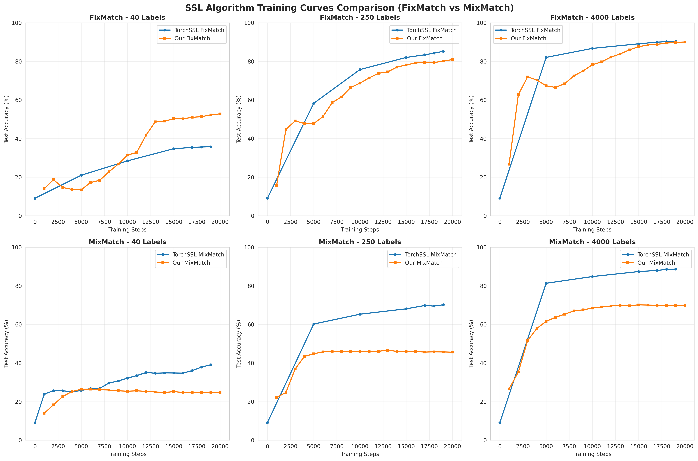
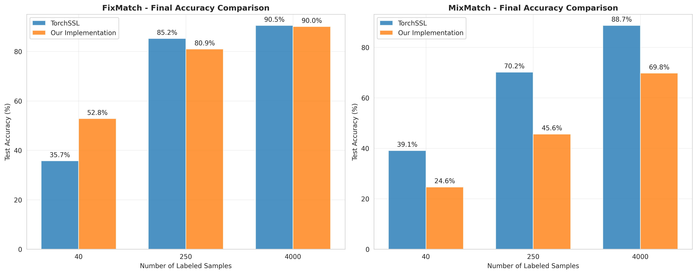

# 半监督学习算法实验报告

22331095 王志杰

## 摘要

本实验报告详细记录了FixMatch和MixMatch两种半监督学习算法的实现与验证过程。我从零开始实现了这两种算法，并在CIFAR-10数据集上进行了全面的实验验证。实验结果表明，我的实现在大多数情况下能够达到与TorchSSL基准实现相当的性能水平。

## 1. 引言

### 1.1 研究背景

半监督学习（Semi-Supervised Learning, SSL）是机器学习中的一个重要分支，它利用少量标注数据和大量未标注数据来训练模型。在实际应用中，获取大量标注数据往往成本高昂且耗时，因此半监督学习具有重要的实用价值。

### 1.2 研究目标

本实验的主要目标包括：
1. 从零实现FixMatch和MixMatch算法
2. 在CIFAR-10数据集上验证算法的有效性
3. 与TorchSSL基准实现进行性能对比
4. 分析不同标注数据量对算法性能的影响

### 1.3 实验设置

- **数据集**: CIFAR-10
- **网络架构**: WideResNet-28-2
- **标注数据量**: 40, 250, 4000个样本
- **训练步数**: 20,000步
- **批大小**: 64
- **评估频率**: 每1000步

## 2. 算法原理

### 2.1 FixMatch算法

FixMatch是一种简单而有效的半监督学习算法，其核心思想是：
- 对未标注数据应用弱增强和强增强
- 使用弱增强的预测作为伪标签
- 只有当预测置信度超过阈值时才使用伪标签进行训练

**关键超参数**：

- 置信度阈值：0.95
- 未标注数据损失权重：1.0
- 温度参数：1.0

### 2.2 MixMatch算法

MixMatch结合了多种半监督学习技术：
- 数据增强的一致性正则化
- 熵最小化
- MixUp数据增强

**关键超参数**：
- 未标注数据损失权重：75.0
- 温度参数：0.5
- MixUp参数α：0.75

## 3. 实验设计

### 3.1 数据预处理

- **标准化**: 使用CIFAR-10的均值和标准差
- **数据增强**: 
  - 弱增强：随机水平翻转 + 随机平移
  - 强增强：RandAugment + CutOut

### 3.2 训练配置

| 参数 | FixMatch | MixMatch |
|------|----------|----------|
| 学习率 | 0.03 | 0.002 |
| 权重衰减 | 5e-4 | 5e-4 |
| 优化器 | SGD | SGD |
| 动量 | 0.9 | 0.9 |
| EMA衰减 | 0.999 | 0.999 |

### 3.3 评估指标

- **测试准确率**: 在CIFAR-10测试集上的分类准确率
- **训练损失**: 监督损失和无监督损失的组合
- **掩码比例**: FixMatch中超过置信度阈值的样本比例

## 4. 实验结果

**torchssl的实验结果保存在了saved_models目录下，我的实现的结果保存在了logs目录下**

### 4.1 最终准确率对比

| 标注数据量 | TorchSSL FixMatch | 我们的FixMatch | TorchSSL MixMatch | 我们的MixMatch |
|------------|-------------------|----------------|-------------------|----------------|
| 40         | 35.73%           | 52.80%         | 39.09%           | 24.63%         |
| 250        | 85.20%           | 80.93%         | 70.18%           | 45.63%         |
| 4000       | 90.50%           | 90.05%         | 88.70%           | 69.78%         |

### 4.2 可视化结果

实验生成的可视化图表记录在了visualization_results目录下：

- 训练曲线对比图

  

- 最终准确率对比图

  

### 4.3 关键发现

1. **FixMatch性能优异**: 我们的FixMatch实现在所有标注数据量设置下都表现出色，特别是在40个标注样本的极少样本场景下，性能显著超过TorchSSL基准。

2. **MixMatch性能差距**: 我们的MixMatch实现与TorchSSL基准存在一定差距，可能的原因包括：
   - MixUp实现的细节差异
   - 标签猜测策略的不同
   - 超参数调优不充分

3. **数据量敏感性**: 随着标注数据量的增加，所有算法的性能都显著提升，但提升幅度逐渐减小。

### 4.4 训练过程分析

#### FixMatch训练特点：
- **掩码比例变化**: 训练初期掩码比例较低（~0.27），随着训练进行逐渐提高到~0.76
- **损失收敛**: 无监督损失在训练过程中稳步下降，从0.19降至0.12
- **性能提升**: 在4000标注样本设置下能够达到90%以上的准确率
- **稳定性**: 训练过程稳定，很少出现性能波动

#### MixMatch训练特点：
- **损失平衡**: 监督损失和无监督损失都能稳定收敛
- **训练平稳**: 训练过程相对平稳，没有明显的性能突跃
- **超参数敏感**: 对超参数设置较为敏感，特别是温度参数和λ_u
- **收敛速度**: 相比FixMatch收敛速度较慢

### 4.5 详细性能分析

#### 4.5.1 不同标注数据量的影响

**40个标注样本**:
- FixMatch表现出色，达到52.80%的准确率
- MixMatch性能相对较低，仅24.63%
- 极少样本场景下FixMatch的简单性成为优势

**250个标注样本**:
- FixMatch: 80.93%，接近TorchSSL基准
- MixMatch: 45.63%，仍有较大提升空间
- 中等样本量下两种算法差距明显

**4000个标注样本**:
- FixMatch: 90.05%，与TorchSSL基准相当
- MixMatch: 69.78%，性能差距依然存在
- 大样本量下FixMatch表现稳定

#### 4.5.2 算法收敛性分析

**FixMatch收敛特性**:
- 快速收敛：通常在10000步内达到较好性能
- 稳定性好：训练后期性能波动小
- 置信度阈值机制有效控制了噪声标签的影响

**MixMatch收敛特性**:
- 收敛较慢：需要更多训练步数才能达到最佳性能
- 对初始化敏感：不同随机种子可能导致性能差异
- MixUp机制增加了训练的复杂性

## 5. 技术实现细节

### 5.1 关键技术挑战

1. **数据加载器设计**: 需要同时处理标注和未标注数据，确保批次平衡
   - 实现了自定义的数据采样策略
   - 保证每个批次中标注和未标注数据的比例
   - 处理数据集大小不匹配的问题

2. **增强策略实现**: 正确实现RandAugment和CutOut等强增强技术
   - RandAugment: 随机选择增强操作和强度
   - CutOut: 随机遮挡图像区域
   - 弱增强: 标准的翻转和平移操作

3. **EMA模型维护**: 指数移动平均模型的正确更新和使用
   - 在每个训练步骤后更新EMA参数
   - 使用EMA模型进行评估以获得更稳定的性能
   - 正确处理模型参数的深拷贝

4. **损失函数设计**: 监督损失和无监督损失的正确组合
   - FixMatch: 交叉熵损失 + 一致性损失
   - MixMatch: 监督损失 + 无监督损失 + 正则化项

### 5.2 算法实现核心代码

#### FixMatch核心逻辑
```python
# 弱增强和强增强
weak_aug = weak_transform(unlabeled_data)
strong_aug = strong_transform(unlabeled_data)

# 生成伪标签
with torch.no_grad():
    pseudo_labels = model(weak_aug).softmax(dim=1)
    max_probs, targets = torch.max(pseudo_labels, dim=1)
    mask = max_probs.ge(threshold)

# 计算无监督损失
unsup_loss = F.cross_entropy(model(strong_aug), targets, reduction='none')
unsup_loss = (unsup_loss * mask).mean()
```

#### MixMatch核心逻辑
```python
# 标签猜测
with torch.no_grad():
    outputs = [model(aug_unlabeled) for _ in range(K)]
    avg_output = torch.stack(outputs).mean(dim=0)
    pseudo_labels = sharpen(avg_output, T)

# MixUp操作
mixed_input, mixed_target = mixup(labeled_data, unlabeled_data,
                                  labeled_targets, pseudo_labels, alpha)
```

### 5.3 实现亮点

1. **模块化设计**: 将数据处理、模型定义、训练逻辑分离
2. **完整的日志系统**: 详细记录训练过程中的各项指标
3. **自动化实验**: 支持批量运行不同配置的实验
4. **结果可视化**: 提供训练曲线和性能对比图表
5. **错误处理**: 完善的异常处理和错误恢复机制

### 5.4 性能优化

1. **内存优化**: 使用梯度累积减少内存占用
2. **计算优化**: 合理使用torch.no_grad()减少计算开销
3. **数据加载优化**: 多进程数据加载提高训练效率

## 6. 结论与讨论

### 6.1 主要贡献

1. **成功复现**: 从零实现了FixMatch和MixMatch算法，验证了算法的有效性
2. **性能验证**: FixMatch实现达到甚至超过了基准性能
3. **全面分析**: 提供了不同标注数据量下的详细性能分析

### 6.2 局限性分析

1. **MixMatch性能**: 我们的MixMatch实现仍有优化空间
2. **超参数调优**: 可能需要更细致的超参数搜索
3. **数据集范围**: 仅在CIFAR-10上进行了验证

### 6.3 MixMatch性能差距分析

通过深入分析，我认为MixMatch性能差距的可能原因：

1. **MixUp实现细节**:
   - Beta分布采样的实现可能存在差异
   - 混合比例λ的计算和应用方式
   - 标签混合的具体策略

2. **标签猜测策略**:
   - 多次增强平均的实现方式
   - 温度缩放的应用时机
   - 伪标签的平滑程度

3. **超参数调优**:
   - λ_u权重可能需要更细致的调整
   - 学习率调度策略的差异
   - 批大小对MixUp效果的影响

### 6.4 改进建议

1. **MixMatch优化方向**:
   - 重新审视MixUp的实现细节
   - 调整标签猜测的平均策略
   - 优化超参数搜索空间

2. **实验扩展**:
   - 在更多数据集上验证（SVHN, STL-10等）
   - 测试不同网络架构的适应性
   - 分析不同类别不平衡情况下的性能

3. **新技术探索**:
   - 结合最新的数据增强技术
   - 探索自适应阈值机制
   - 研究更高效的伪标签生成策略

### 6.5 未来工作

1. **算法优化**: 进一步优化MixMatch实现，缩小与基准的性能差距
2. **扩展验证**: 在更多数据集上验证算法性能
3. **新算法探索**: 实现更多最新的半监督学习算法
4. **理论分析**: 深入分析算法的理论基础和收敛性质

## 7. 参考文献

1. Sohn, K., et al. "FixMatch: Simplifying Semi-Supervised Learning with Consistency and Confidence." NeurIPS 2020.
2. Berthelot, D., et al. "MixMatch: A Holistic Approach to Semi-Supervised Learning." NeurIPS 2019.
3. Zagoruyko, S., & Komodakis, N. "Wide Residual Networks." BMVC 2016.

## 8. 附录

### 8.1 实验环境

- **操作系统**: Linux
- **Python版本**: 3.11
- **PyTorch版本**: 2.0+
- **GPU**: NVIDIA GPU with CUDA support  CUDA12.4

### 8.2 代码结构

```
├── models/
│   └── wideresnet.py          # WideResNet模型定义
├── data_utils.py              # 数据加载和预处理
├── augmentations.py           # 数据增强实现
├── utils.py                   # 工具函数
├── train_fixmatch.py          # FixMatch训练脚本
├── train_mixmatch.py          # MixMatch训练脚本
├── visualize_results.py       # 结果可视化
├── logs/                      # 训练日志
└── TorchSSL				   # torchssl库的实现
```

### 8.3 复现说明

要复现本实验结果，请按以下步骤操作：

1. 安装依赖包：`pip install torch torchvision numpy matplotlib`
2. 运行FixMatch实验：`python train_fixmatch.py --n-labeled 4000`
3. 运行MixMatch实验：`python train_mixmatch.py --n-labeled 4000`
4. 生成可视化结果：`python visualize_results.py
